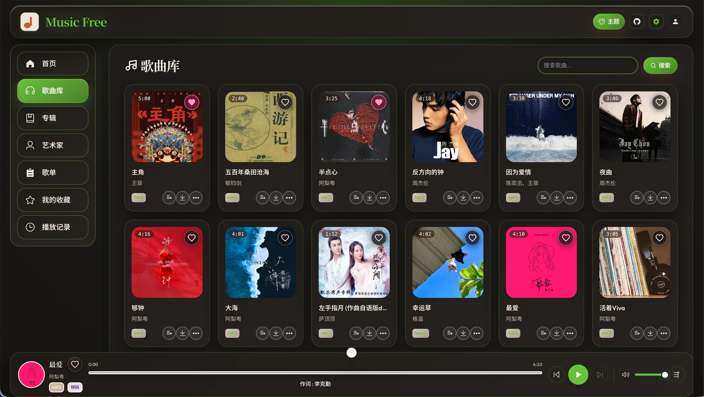

<p align="center">
  
</p>

曾几何时，想听无损音乐往往要分别搭建多套服务：

- **媒体库管理**：[Navidrome](https://www.navidrome.org/)
- **标签刮削**：[MusicTagWeb](https://xiers-organization.gitbook.io/music-tag-web-v2)
- **搜索与下载**：[MusicDL](https://musicdl.readthedocs.io/en/latest/)

MusicFree 希望用 **All in One** 的方式，**让听歌这件事变得简单一点**。



## 扩展性

提供音乐全生命周期的管理能力：

- 从 **在线搜索** 到 **下载入库**，便捷获取曲目
- 从 **去重** 到多格式 **播放**，完整的曲库维护
- 从 **封面** 到 **歌词** 的刮削，补全歌曲信息
- 支持各平台 **歌单同步**（链接导入与定时同步）
- 支持艺术家、专辑的 **匹配与刮削**，自动补全头像与简介

上述扩展能力均通过 **[插件](/plugin)** 实现，可按需订阅注册表、安装不同插件组合。

| 场景                   | 文档                                                                                                                                                                                                  |
| ---------------------- | ----------------------------------------------------------------------------------------------------------------------------------------------------------------------------------------------------- |
| 音乐搜索 / 去重 / 刮削 | [音乐管理](https://ansgoo.github.io/music-free-site/music)                                                                                                                                            |
| 专辑浏览与专辑级刮削   | [专辑](https://ansgoo.github.io/music-free-site/album)                                                                                                                                                |
| 艺术家与批量头像       | [艺术家](https://ansgoo.github.io/music-free-site/artist)                                                                                                                                             |
| 歌单导入与同步         | [歌单](https://ansgoo.github.io/music-free-site/playlist)                                                                                                                                             |
| 插件安装与编排         | [插件](https://ansgoo.github.io/music-free-site/plugin) · [注册表](https://ansgoo.github.io/music-free-site/plugin-registry) · [插件合集](https://ansgoo.github.io/music-free-site/plugin-collection) |

## 兼容性

支持完整的 **OpenSubsonic** 与部分 **Navidrome** 风格 REST API。常见客户端例如：

- [音流](https://music.aqzscn.cn/)
- [Supersonic](https://github.com/dweymouth/supersonic)
- Feishin、Symfonium、DSub 等 Subsonic / OpenSubsonic 兼容应用

接口说明见 [OpenSubsonic API](https://ansgoo.github.io/music-free-site/opensubsonic-api)、[Navidrome API](https://ansgoo.github.io/music-free-site/navidrome-api)。

## 安装

Docker Compose 示例（请按实际环境修改端口与卷路径）：

```yaml
services:
  music-free:
    image: ansgoo/music-free:latest
    container_name: music-free
    restart: unless-stopped
    ports:
      - "4533:4533"
    volumes:
      - /vol1/docker/music-free:/app/data
      - /vol1/music:/app/music
```

部署后尽快修改密码（见 [用户模块](https://ansgoo.github.io/music-free-site/user)）。

## 赞赏

<p align="center">
  
</p>
