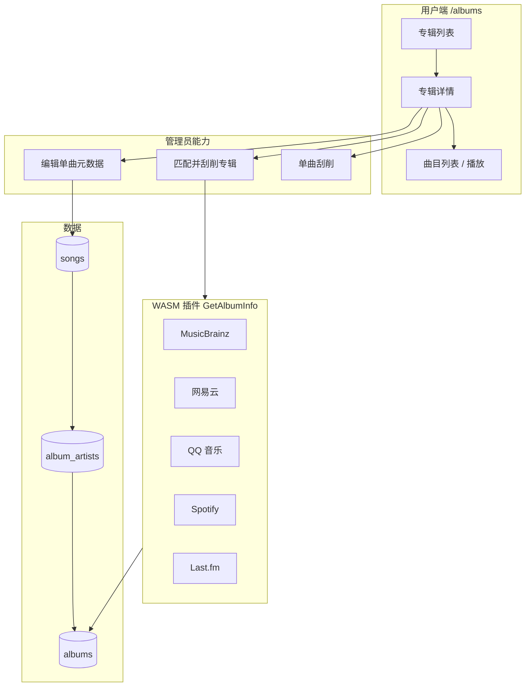

# 专辑模块 · 功能介绍

## 1. 模块概述

**专辑模块**负责曲库中专辑的浏览、曲目播放、封面与元数据维护，以及多艺术家合辑的展示。核心入口为 Web 前端的 **`/albums`**（侧栏「专辑」）与 **`/albums/:id`**（专辑详情）。

与艺术家模块不同，专辑**没有**独立的管理后台页；管理员能力（专辑刮削、曲目元数据编辑、空专辑删除等）集成在 **专辑详情页** 与 **[音乐管理](/music)** 的刮削 Tab 中。



扫描本地或 WebDAV 媒体源后，系统按文件标签中的 **专辑名 + 主艺术家** 聚合生成 `albums` 记录；曲目通过 `songs.album_id` 归属专辑，并通过 **`album_artists`** 维护「参与艺术家」集合（合辑、群星盘等）。

## 2. 访问与权限

| 能力                      | 路径                         | 用户                         |
| ------------------------- | ---------------------------- | ---------------------------- |
| 专辑列表                  | `/albums`                    | 所有登录用户                 |
| 专辑详情                  | `/albums/:id`                | 所有登录用户                 |
| 播放、收藏、下载曲目      | 详情页曲目行                 | 登录用户（下载依服务端策略） |
| 匹配并刮削专辑            | 详情页                       | 管理员                       |
| 编辑曲目元数据 / 单曲刮削 | 详情页曲目行                 | 管理员                       |
| 删除空专辑                | 列表或艺术家详情中的专辑卡片 | 管理员                       |
| 批量曲目刮削              | `/admin/music` → 音乐刮削    | 管理员                       |

## 3. 专辑浏览

### 3.1 专辑列表

- **展示**：卡片网格，含封面、专辑名、主艺术家、年份、曲目数。
- **搜索**：按专辑名（及关联信息）模糊匹配；支持 URL 查询参数 `q`、`page`、`pageSize`。
- **分页**：默认每页 20 条。
- **按艺术家筛选**：内部 API 支持 `artistId` 参数（艺术家详情页跳转专辑时使用）。
- **空状态**：未扫描媒体库时提示「扫描音乐库后即可在此浏览专辑」。

### 3.2 专辑详情

| 区域       | 说明                                                                                            |
| ---------- | ----------------------------------------------------------------------------------------------- |
| 头部       | 封面、专辑名、主艺术家、年份、流派、总时长、曲目数                                              |
| 参与艺术家 | 来自 `album_artists` 的艺术家头像条（最多展示 5 个，超出折叠为「+N」）；点击跳转 `/artists/:id` |
| 操作       | **播放全部**；管理员可见 **匹配并刮削**                                                         |
| 曲目列表   | 曲序、标题、码率/品质、格式、收藏、时长；点击行播放                                             |

**曲目列表操作**（管理员）：

| 操作       | 说明                                                            |
| ---------- | --------------------------------------------------------------- |
| 编辑元数据 | 弹窗修改标题、艺术家、专辑等，保存后触发 `album_artists` 重算   |
| 刮削元数据 | 对单首曲目调用 `ScraperSong` 链路（与音乐管理批量刮削相同引擎） |
| 下载       | 以原始文件流下载到本地（保留服务端建议文件名）                  |

所有用户可对单曲使用 **收藏**（心形按钮）。

### 3.3 封面展示

- OpenSubsonic 封面 ID：**`al-{albumId}`**。
- Web 前端通过 `getCoverArt` 拉取封面图；无封面时显示占位图标。
- 专辑刮削保存后，封面 key 存于 `albums.cover_art`（`sha256-...` 文件位于 `music.cover_path`）。

**占位专辑名**：`Unknown Album`（大小写不敏感）不分配 `al-` 封面 ID，且**不支持**专辑级刮削。

## 4. 参与艺术家（album_artists）

### 4.1 作用

一张专辑可能对应多位艺术家（合作专辑、合辑、原声带等）。除 **主艺术家**外，系统记录了多位艺术家与专辑的参与关系，使得：

- 专辑详情页展示「参与艺术家」头像条；
- 各参与艺术家的详情页也能列出该专辑。

## 5. 专辑匹配并刮削（管理员）

### 5.1 能做什么

在专辑详情页点击 **「匹配并刮削」**：

1. 后端使用专辑的 **主艺术家名 + 专辑名** 调用已启用、支持 **album** 编排维度的插件（`GetAlbumInfo`）。
2. 汇总各插件返回的 **候选列表**（每个插件至多一条），弹窗展示封面预览、专辑名、艺术家、发行日期、简介、来源。
3. 管理员选择候选并 **保存确认** 后写入数据库。

**特点**：预览阶段 **不写库**；须人工确认，避免误匹配。

### 5.2 限制与插件

- **不支持刮削**：专辑名为 `Unknown Album` 占位。

插件需在 **插件管理**（`/admin/plugin`）启用，且刮削编排包含 **album** 字段。

### 5.4 与曲目刮削的关系

| 维度     | 专辑「匹配并刮削」   | 详情页单曲「刮削」 / 音乐管理批量刮削            |
| -------- | -------------------- | ------------------------------------------------ |
| 插件能力 | `GetAlbumInfo`       | `ScraperSong`（+ 可选 `GetCover` / `GetLyrics`） |
| 作用对象 | 整张专辑元数据与封面 | 单首歌曲标签与封面                               |
| 入口     | `/albums/:id`        | 曲目行按钮或 `/admin/music`                      |
| 确认方式 | 弹窗选候选后保存     | 单曲刮削多为自动应用；批量可勾选强制重刮         |

二者互补：先批量修正曲目，再对整张专辑统一补封面与发行信息。

## 6. 管理员维护

### 6.1 删除专辑

- **条件**：管理员 + 专辑下 **歌曲数为 0**。
- **入口**：专辑列表卡片删除按钮，或艺术家详情页中的空专辑卡片。
- **说明**：仅删除数据库中的专辑记录，**不删除**磁盘音频文件。

### 6.2 编辑曲目元数据

通过详情页 **编辑** 打开 `SongMetadataEditDialog`，可修改曲名、艺术家、专辑归属等。保存后：

- 更新 `songs` 表；
- 必要时触发旧/新专辑的 `album_artists` 重算；
- 刷新当前专辑详情展示。

---

## 7. OpenSubsonic 与第三方客户端

Music Free 向 Subsonic/OpenSubsonic 客户端暴露标准专辑接口：

| 接口                             | 用途                                               |
| -------------------------------- | -------------------------------------------------- |
| `getAlbum`                       | 专辑元数据 + 曲目列表                              |
| `getAlbumList` / `getAlbumList2` | 按类型列出专辑（最新、随机、按年、按流派、收藏等） |
| `getMusicDirectory`              | 以 `id=专辑ID` 浏览专辑内曲目                      |
| `getCoverArt`                    | `id=al-{albumId}` 获取封面                         |

**getAlbumList 类型示例**（`type` 参数）：`newest`、`random`、`alphabeticalByName`、`alphabeticalByArtist`、`frequent`、`recent`、`starred`、`byYear`（需 `fromYear`/`toYear`）、`byGenre`（需 `genre`）等。

Navidrome 兼容 REST（实验性）：`GET /api/album`、`GET /api/album/:id`。

---

## 8. 典型工作流

### 8.1 浏览与播放

```text
扫描媒体源 → /albums 浏览
    → 进入详情 → 播放全部或点击单曲
    → OpenSubsonic 客户端亦可通过 getAlbum 播放
```

### 8.2 补全专辑封面与信息

```text
/admin/plugin 启用 MusicBrainz / 网易云 等
    → /albums/:id → 「匹配并刮削」
    → 对比候选封面与发行日期 → 保存确认
```

### 8.3 整理合辑与多艺人专辑

```text
详情页编辑各曲目艺术家归属
    → 保存后 album_artists 自动更新
    → 参与艺术家头像条与艺术家详情页专辑列表同步
```

### 8.4 批量修正曲目后再统一专辑

```text
/admin/music → 音乐刮削 → 批量处理未刮削曲目
    → 回到专辑详情 → 「匹配并刮削」统一封面
```

---

## 9. 常见问题

**Q：列表里没有专辑？**  
A: 确认已配置媒体源并完成扫描；检查歌曲标签是否包含专辑名。

**Q：封面一直是占位图？**  
A: 可对专辑执行「匹配并刮削」；或依赖扫描时从嵌入封面提取（`songs` 封面回写）。`Unknown Album` 不会生成封面 ID。

**Q：「匹配并刮削」无候选？**  
A: 检查插件是否启用、是否支持 `getAlbumInfo`、API 配置是否正确；专辑名勿为占位；查看弹窗警告中的各插件尝试信息。

**Q：参与艺术家显示不全？**  
A: 确认各曲目 `artist_id` 正确；保存元数据或重扫后会触发重新计算；主艺术家不会重复出现在「参与艺术家」条中。

**Q：删除专辑失败？**  
A: 仅当专辑下 **无歌曲** 时可删；需先将曲目移到其他专辑或删除曲目记录。
