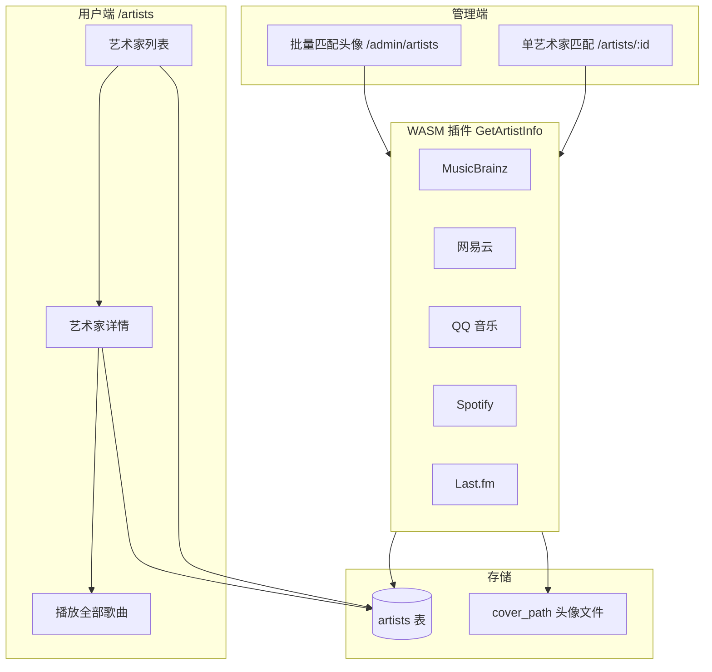

# 艺术家模块 · 功能介绍

## 1. 模块概述

**艺术家模块**负责曲库中艺术家的浏览、展示、元数据补全与头像管理。功能分布在两个入口：

| 入口           | 路径                       | 侧栏名称   | 主要用户     |
| -------------- | -------------------------- | ---------- | ------------ |
| **艺术家浏览** | `/artists`、`/artists/:id` | 艺术家     | 所有登录用户 |
| **艺术家管理** | `/admin/artists`           | 艺术家管理 | 管理员       |



扫描本地媒体库后，系统按歌曲标签中的 **艺术家名** 聚合生成 `artists` 记录；专辑与艺术家通过 **`album_artists`** 关联表支持「主艺术家 + 参与艺术家」等多艺人专辑。

---

## 2. 访问与权限

### 2.1 艺术家浏览（用户端）

- **列表**：`/artists` — 网格展示艺术家卡片，支持关键词搜索与分页。
- **详情**：`/artists/:id` — 头像、专辑列表、「播放全部歌曲」等。
- **权限**：需登录；浏览与播放对所有用户开放。

### 2.2 艺术家管理（管理端）

- **批量匹配头像**：`/admin/artists`（侧栏「艺术家管理」）。
- **权限**：仅管理员（`requiresAdmin`）。
- **旧路径**：`/artists/photo-batch-match` 重定向至 `/admin/artists`。

### 2.3 单艺术家刮削（管理端操作，用户端页面）

- 在 **`/artists/:id`** 详情页，管理员可见 **「匹配」** 按钮，用于拉取外部目录候选并人工确认保存（无需进入 `/admin/artists`）。

---

## 3. 艺术家浏览

### 3.1 艺术家列表

- **展示**：卡片网格，含头像（若有）、名称、专辑数量。
- **搜索**：按名称模糊匹配，回车或点击搜索；查询参数同步到 URL（`q`、`page`、`pageSize`）。
- **分页**：默认每页 20 条，可翻页浏览大库。
- **空状态**：尚未扫描媒体库时提示「扫描音乐库后即可按艺术家浏览」。

### 3.2 艺术家详情

| 区域   | 说明                                                                   |
| ------ | ---------------------------------------------------------------------- |
| 头部   | 头像、`专辑数`、**播放全部歌曲**（将该艺术家下各专辑曲目加入播放队列） |
| 专辑区 | 网格展示关联专辑；点击进入 `/albums/:id`                               |
| 元数据 | 出生年月、国籍/地区、个人简介等（刮削保存后可见）                      |

**专辑关联规则**：详情页专辑列表包含：

- 以该艺术家为 **主艺术家**（`albums.artist_id`）的专辑；
- 通过 **`album_artists`** 标记为参与者的专辑（`role: participant`）。

因此合作专辑、群星合辑会出现在相关艺术家名下。

### 3.3 管理员维护操作（详情 / 列表）

| 操作       | 条件                    | 说明                                 |
| ---------- | ----------------------- | ------------------------------------ | --- |
| 删除艺术家 | 管理员 + **专辑数为 0** | 列表卡片或详情上下文；有专辑时不可删 |     |

删除为数据库记录清理，**不删除磁盘上的音频文件**。

---

## 4. 单艺术家匹配（刮削确认）

### 4.1 能做什么

管理员在艺术家详情页点击 **「匹配」** 后：

1. 后端按编排顺序调用已启用、支持 **艺术家维度** 的刮削插件（`GetArtistInfo`）。
2. 汇总各插件返回的 **候选列表**（可能多条），弹窗展示：
   - 艺术家名、头像预览、出生年月、国籍/地区、简介、来源插件。
3. 管理员选中一条候选，点击 **「保存确认」** 写入数据库。

**特点**：刮削阶段 **不自动写库**；必须人工确认，避免误匹配。

## 5. 批量匹配艺术家照片（管理端）

### 5.1 能做什么

对曲库中**大量艺术家**自动拉取头像，适合在初次建库或批量补图时使用。页面路径：**`/admin/artists`**。

核心能力：

- 按条件筛选目标艺术家（默认仅 **缺失头像**）。
- 后台异步任务，实时进度与逐条结果。
- 多插件 **短路策略**：每位艺术家按插件顺序尝试，**任一插件成功即停止**。
- 匹配成功时 **立即写库**，无需额外点击「应用」。
- 支持对失败/跳过项 **重试**（生成新任务，仅包含未成功艺术家）。

### 5.2 任务配置

| 选项             | 默认           | 说明                                            |
| ---------------- | -------------- | ----------------------------------------------- |
| 仅处理缺失头像   | 开启           | 只处理 `cover_art` 为空的艺术家                 |
| 允许覆盖已有头像 | 关闭           | 开启后也会处理已有头像的艺术家                  |
| 插件顺序         | 空（后端默认） | 多选；仅列出支持 `GetArtistInfo` 且已启用的插件 |

点击 **「创建批量匹配任务」** 后返回 `taskId`，页面自动轮询状态（约 3 秒）并刷新结果列表。

### 5.3 任务状态与结果

**状态汇总**：任务 ID、状态（`pending` / `running` / `success` / `failed`）、进度百分比、总数、已处理、成功、失败、跳过。

**逐条结果**：艺术家名、状态标签、所用插件、匹配到的封面 key（成功时可预览缩略图）。失败项悬停可查看 **错误码与错误信息**。

**重试**：当 `失败 + 跳过 > 0` 时，可点击 **「重试失败/跳过项」**，系统为这批艺术家创建新任务。

### 5.4 匹配逻辑要点

```text
对每位艺术家:
  按 pluginOrder（或默认顺序）遍历插件
    调用 GetArtistInfo(artistName)
    若返回合法 coverArt key → 标记成功，写库，停止尝试后续插件
    若失败 / 空结果 / URL 头像 / key 格式非法 → 尝试下一个插件
  全部插件失败 → 标记 failed
```

- 合法 `coverArt` key 格式：`sha256-[64位小写十六进制]`（可带扩展名由存储层解析）。
- 并发：按 CPU 核心数等工作线程池处理，单任务内进度持续回写。

### 5.5 与单艺术家「匹配」的区别

| 维度     | 详情页「匹配」               | 批量匹配头像                     |
| -------- | ---------------------------- | -------------------------------- |
| 入口     | `/artists/:id`               | `/admin/artists`                 |
| 范围     | 当前 1 位艺术家              | 库内符合条件的全部（或重试子集） |
| 确认方式 | 弹窗人工选择候选             | 自动取插件首条合法结果           |
| 元数据   | 可保存简介、国籍、出生年月等 | 主要更新头像（`coverArt`）       |
| 写库时机 | 用户点击「保存确认」         | 每条匹配成功时立即写库           |

---

## 6. OpenSubsonic 与第三方客户端

Music Free 作为 OpenSubsonic 服务器，向客户端暴露标准艺术家相关接口，与 Web UI 共用同一曲库数据：

| 接口                               | 用途                                     |
| ---------------------------------- | ---------------------------------------- |
| `getArtists`                       | 按首字母索引列出艺术家                   |
| `getArtist`                        | 艺术家及其专辑目录                       |
| `getArtistInfo` / `getArtistInfo2` | 简介、图片 URL、相似艺术家、热门歌曲等   |
| `getIndexes`                       | 索引浏览                                 |
| `getMusicDirectory`                | 目录树导航（媒体源 / 艺术家 / 专辑层级） |
| `getCoverArt`                      | `id=ar-{artistId}` 获取艺术家封面        |

Web 前端头像 URL 形如：`/rest/api/v1/artists/{id}/avatar`（需认证）。

Navidrome 兼容 REST（实验性）：`GET /api/artist`、`GET /api/artist/:id`。

## 7. 典型工作流

### 7.1 新库补全艺术家头像

```text
扫描媒体源 → 生成 artists
    → /admin/plugin 启用 netease / musicbrainz 等
    → /admin/artists → 勾选「仅缺失头像」→ 创建批量匹配任务
    → 等待任务完成 → 在 /artists 浏览验证头像
```

### 7.2 修正单个艺术家的简介与头像

```text
/artists → 进入详情 → 「匹配」
    → 在候选表中对比来源与简介 → 保存确认
    → 刷新后查看头像与元数据
```

### 7.3 客户端浏览

```text
Feishin / Ultrasonic 等连接 OpenSubsonic
    → getArtists / getArtist 浏览
    → getArtistInfo 查看简介与相似艺术家
```

---

## 8. 常见问题

**Q：列表里艺术家没有头像？**  
A: 尚未刮削或批量匹配；到 `/admin/artists` 跑批量任务，或在详情页用「匹配」手动确认。确认 `music.cover_path` 配置正确且插件已启用。

**Q：批量任务大量失败？**  
A: 检查插件配置（API Key、限流）；查看结果条目的错误信息；常见原因包括插件返回 URL 而非本地 `sha256-` 文件名、艺术家名称为空或 `Unknown Artist`。

**Q：删除艺术家失败？**  
A: 仅当 **专辑数为 0** 时可删；需先移除或合并其专辑关联。
