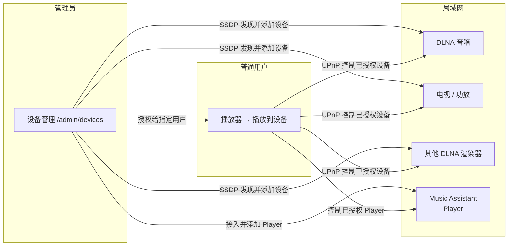

# 设备

相关文档：[音乐管理](/music) · [歌单](/playlist) · [用户](/user)


## 1. 模块概述

**设备模块**让 MusicFree 将音乐推送到局域网内的音频设备上播放，让手机 / 电脑成为遥控器，让客厅的音响出声。支持两种接入方式：

- **DLNA / UPnP AV**：原生协议，直连局域网内的 DLNA 设备（智能音箱、电视、功放、DLNA 播放器等）。
- **Music Assistant**：通过 [Music Assistant](#3-music-assistant-接入管理员) 集成任意硬件设备（AirPlay、Chromecast、Snapcast、MQTT 等）。


> 该功能自 **V1.2.2** 起提供，其中 **Music Assistant** 支持自 **V1.2.3** 起提供，详见 [发布日志](/changelog)。



**权限模型**：

- **设备只能由管理员添加**：管理员通过 SSDP 发现局域网内的 DLNA 设备并登记入库，或接入 Music Assistant 后添加其 Player。
- **管理员按需授权**：添加后可把设备 **授权给某个普通用户**。
- **普通用户只可用被授权的设备**：播放时仅能选择管理员已授权给 **本人** 的设备。

**能力边界**：

- 设备管理仅通过 **Web UI** 提供，**不在** OpenSubsonic / Navidrome 协议中暴露。
- 只能推送到 **局域网内** 的设备：DLNA 设备要求支持 **DLNA / UPnP AV**（MediaRenderer）；AirPlay、Chromecast、Snapcast、MQTT 等其他协议需通过 **Music Assistant** 接入，无法直接控制第三方云端音箱（需厂商 App / 平台开放能力）。

## 2. 访问与权限

| 角色     | 入口                          | 路径           | 能力                                           |
| -------- | ----------------------------- | -------------- | ---------------------------------------------- |
| 管理员   | 管理后台侧栏 → **设备管理**   | `/admin/devices` | 发现 / 添加设备、查看在线状态、**授权给用户**、播放控制 |
| 管理员   | 管理后台 → **系统配置**       | —              | 配置 **Music Assistant** 访问地址 / 账号 / token 并启用 |
| 普通用户 | 播放器 → **播放到设备**       | `/devices`     | 仅能选择**被授权给本人**的设备进行播放与简单控制 |

- **管理员**：须管理员权限（`requiresAdmin`）；负责设备的添加、管理与授权。
- **普通用户**：须登录；只能查看、使用管理员 **授权给本人** 的设备，看不到其他设备。

## 3. Music Assistant 接入（管理员）

**Music Assistant** 是一个开源的本地音乐媒体管理器，打破了音乐生态的壁垒，赋予你对自己音乐库和播放设备的完全控制权。它像一个音乐界的“万能遥控器”或“音乐库管家”，支持 AirPlay、Chromecast、DLNA、Snapcast、MQTT 等多种协议，兼容新老设备——无论是崭新的智能音箱，还是多年前的老式功放，甚至是 DIY 的树莓派播放器，都能成为它的播放终端。


**为什么选择 Music Assistant：** DLNA 是本项目原生支持的硬件设备；AirPlay、Chromecast 等其他设备因社区对第三方库的实现有差异，本项目无法直接集成。但通过 Music Assistant 可以集成任意硬件设备，即可在 MusicFree 中将单曲、专辑、歌单直接播放到 Music Assistant 的 Player。

### 3.1 接入步骤

1. 部署 **Music Assistant**，并获取其访问授权 `token`（Music Assistant 一般以 Docker `host` 网络模式部署，Web 访问端口为 `8095`）。
2. 打开 Music Assistant 设置，添加音乐源，选择 **OpenSubsonic Media Server Library** 插件，配置 MusicFree 的地址、用户名、密码，等待同步完成。

   > **注意**：MusicFree 支持完整的 OpenSubsonic 协议。Music Assistant 默认使用自己的音乐库进行播放，因此推送到 Music Assistant 的音乐必须存在于其音乐库中。

3. 打开 MusicFree，进入「系统配置」页面，配置 Music Assistant 的访问地址、账号、token，并启用 Music Assistant。


### 3.2 使用 Player 播放

- 启用后进入「设备发现」页，即可看到 Music Assistant 发现的局域网设备（Player）。
- 在设备管理页面可以添加 Music Assistant 的 Player，并加入设备列表。
- 设备列表中的设备只有管理员添加并**授权给某个普通用户**后，该普通用户才能正常使用该设备进行音乐播放。


## 4. 设备添加（管理员）

### 4.1 设备发现

服务端通过 **SSDP（Simple Service Discovery Protocol）** 在局域网内组播发现 DLNA 设备：

- 进入「设备管理」时自动发起 **发现**，并持续监听设备的 **上线 / 下线** 通知。
- 发现结果展示设备的 **名称**、**型号** 与 **服务能力**（如支持的传输协议）。
- 未添加的设备仅作为 **候选** 展示，**不会**自动入库，须管理员手动 **添加**。

> **提示**：若设备未出现在列表，请确认设备与 MusicFree 处于 **同一局域网 / 子网**，且设备已开机并启用 DLNA / 投屏功能；部分设备需要先在自身设置中开启「DLNA 渲染」或「局域网共享 / 投屏」。若已启用 Music Assistant，其 Player 也会出现在发现列表中，详见 [Music Assistant 接入](#3-music-assistant-接入管理员)。

### 4.2 添加设备

管理员在候选设备列表中点击 **添加**，将该设备登记入库：

- 添加后可设置设备 **名称**（便于识别）等基本信息。
- 已添加的设备进入 **设备列表**，可由管理员统一管理。

## 5. 设备管理（/admin/devices）

「设备管理」页面供管理员集中管理局域网内已添加的 DLNA 设备：

| 能力             | 说明                                                       |
| ---------------- | ---------------------------------------------------------- |
| **设备列表**     | 展示已添加设备的名称、类型、状态与授权对象                 |
| **刷新发现**     | 手动触发一次 SSDP 发现，拉取最新候选设备                   |
| **添加设备**     | 将发现的候选设备登记入库                                   |
| **授权给用户**   | 选择某个普通用户，将该设备授权给 TA 使用                   |
| **取消授权**     | 收回设备授权，对应普通用户将无法再使用该设备               |
| **移除设备**     | 从设备列表移除（删除登记），所有授权一并失效               |
| **播放控制**     | 对设备执行 **播放 / 暂停 / 停止 / 上一曲 / 下一曲**        |

### 5.1 设备授权

- 一台设备可授权给 **一个或多个普通用户**，也可同时保留给管理员自己使用。
- 授权不限制设备在线状态：设备离线时授权仍保留，上线后普通用户即可恢复使用。
- **取消授权 / 移除设备** 后，该用户 **立即失去** 对该设备的使用能力。

## 6. 播放到设备（普通用户）

普通用户在 MusicFree 中可将以下内容推送到 **已被授权给本人** 的设备：

| 内容         | 操作说明                                                   |
| ------------ | ---------------------------------------------------------- |
| **单曲**     | 歌曲列表 / 详情页选择 **播放到设备**，选择已授权设备播放   |
| **专辑**     | 专辑详情选择 **播放到设备**，按专辑曲目顺序连续播放        |
| **歌单**     | 歌单详情选择 **播放到设备**，按歌单曲目顺序连续播放        |
| **当前播放** | 播放器内 **切换播放设备**，将正在播放的内容转移到目标设备  |

推送后：

- 设备开始播放由 MusicFree 提供的 **音频流**（由 MusicFree 服务端对曲目进行流式转码 / 直出）。
- 普通用户仅可对 **授权给本人** 的设备执行播放控制；未授权设备不出现在其列表中。
- 播放进度、曲目变化由服务端与设备之间通过 UPnP 状态同步，页面可查看当前设备播放状态。

> **注意**：推送到 DLNA 设备后，声音由 **目标设备** 播出，浏览器 / 设备默认不再发声；如需切回本地播放，请断开或选择 **本地播放**。

## 7. 典型工作流

### 7.1 管理员添加设备并授权

```text
/ 管理后台 → 设备管理 → 刷新发现
    → 选择候选设备 → 添加
    → 设备列表中对该设备「授权给用户」→ 选择目标普通用户
    → 完成，该用户即可使用该设备
```

### 7.2 普通用户推送到音箱播放一首歌

```text
确认音箱已开机且与 MusicFree 同一局域网
    → 歌曲详情 / 列表 →「播放到设备」
    → 选择已授权的目标音箱 → 音箱开始播放
    → 播放器内可暂停 / 下一曲 / 停止
```

### 7.3 管理员收回设备权限

```text
设备管理 → 选择设备 →「取消授权」或「移除设备」
    → 对应普通用户立即无法再使用该设备
```

### 7.4 通过 Music Assistant 播放到 AirPlay / Chromecast 设备

```text
部署 Music Assistant（Docker host 网络模式，端口 8095）
    → 在 Music Assistant 中添加音乐源（OpenSubsonic Media Server Library）并配置 MusicFree
    → MusicFree「系统配置」中填写 Music Assistant 地址、账号、token 并启用
    → 设备发现页添加 Music Assistant Player → 授权给普通用户
    → 普通用户将单曲 / 专辑 / 歌单「播放到设备」→ 选择已授权的 Player
```

## 8. 常见问题

**Q：普通用户为什么看不到设备列表里的设备？**  
A：设备需要管理员 **添加并授权** 给该用户后才能使用。请联系管理员在 **设备管理** 中完成授权。

**Q：普通用户能自己添加局域网设备吗？**  
A：不能。设备添加仅限管理员，普通用户只能使用被授权的设备。

**Q：为什么设备管理页面找不到我的音响？**  
A：请确认设备与 MusicFree 处于**同一局域网 / 子网**、已开机且开启了 DLNA / 投屏 / 局域网共享功能；部分设备需在自身设置中手动开启。也可点击 **刷新发现** 重新扫描。

**Q：取消授权后设备还在吗？**  
A：在。取消授权只收回某个用户的使用权，设备仍保留在管理员设备列表中；需要彻底移除请使用 **移除设备**。

**Q：DLNA 设备能跨局域网 / 远程推送吗？**  
A：不能。DLNA 基于局域网组播发现与控制，仅支持同一局域网内的设备。

**Q：为什么 AirPlay / Chromecast 设备无法直接被发现？**  
A：这些协议因社区对第三方库的实现差异，本项目无法直接集成。请通过 **Music Assistant** 接入，再在 MusicFree 中启用并添加其 Player 使用，详见 [Music Assistant 接入](#3-music-assistant-接入管理员)。

**Q：为什么设备发现页看不到 Music Assistant 的 Player？**  
A：请确认：已在「系统配置」中填写 Music Assistant 的访问地址、账号、token 并**启用**；Music Assistant 已正常部署且与 MusicFree 处于同一局域网；Music Assistant 中已配置音乐源并同步完成。可稍等片刻后再次进入发现页或刷新。

**Q：推送到 Music Assistant 后没有声音或报「曲目不存在」？**  
A：Music Assistant 默认使用 **自己的音乐库** 播放，只有在其库中存在的音乐才能播放。请在 Music Assistant 中通过 `OpenSubsonic Media Server Library` 插件配置 MusicFree 并等待音乐同步完成。
