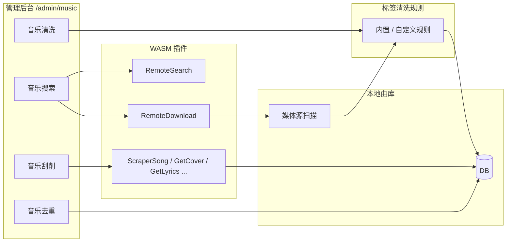

# 音乐管理

相关文档：[插件](/plugin) · [插件合集](/plugin-collection) · [专辑](/album) · [歌单](/playlist) · [用户](/user)


## 1. 模块概述

**音乐管理**是 MusicFree 管理后台中的核心运维模块，路径为 **`/admin/music`**（侧栏「音乐管理」）。它将四类与曲库质量相关的能力整合在同一页面，通过 Tab 切换：

| Tab          | 功能定位                                                      |
| ------------ | ------------------------------------------------------------- |
| **音乐搜索** | 通过插件从外部平台检索歌曲，并一键下载入库                    |
| **音乐去重** | 基于音频指纹发现库内重复曲目，支持批量或手动清理              |
| **音乐清洗** | 按规则规范化标签字段，在扫描入库或批量任务中修正脏数据        |
| **音乐刮削** | 为本地曲目补全/修正元数据（标题、艺术家、专辑、封面、歌词等） |

搜索/下载与刮削共用 **WASM 插件运行时**；去重基于本地指纹比对；清洗依赖可配置的**标签规则引擎**（内置 + 自定义规则）。各 Tab 面向场景不同：搜索/下载侧重「把歌引进来」，去重侧重「库内整洁」，清洗侧重「标签规范」，刮削侧重「信息补全」。

与音乐管理配套的运维能力还包括：

- **媒体源**：在 `/admin/sources` 配置本地媒体源与 WebDAV媒体源，扫描后才有可管理的曲库
- **在线播放**：登录用户访问 `/music` 可浏览曲库并使用 Web 播放器。



## 2. 访问与权限

- **音乐管理**：登录管理员账号后，访问 `/admin/music`即可对所有音乐作品进行管理。
- **音乐使用**：登录授权用户访问 `/music` 浏览曲库并使用播放器。

相关配置页面：

- **插件管理**（`/admin/plugin`）：安装、启用/禁用插件，编辑插件 JSON 配置。
- **媒体源管理**（`/admin/sources`）：本地/WebDAV 音乐目录、扫描任务。

## 3. 音乐搜索（远程搜索与下载）


### 3.1 能做什么

- 输入**关键词**（歌名、歌手等），在已选中的远程插件上**并行搜索**。
- 以**流式**方式展示各插件返回的候选列表（无需等全部插件结束才看到第一条结果）。
- 对单条结果点击**下载**：由插件拉取音频 → 写入本地目录 → **自动扫描入库**，即可在 OpenSubsonic 客户端或前端曲库中播放。

### 3.2 界面操作

1. 在搜索框输入关键词，按 **Enter** 或触发搜索。
2. 在插件芯片行中勾选要使用的插件（默认全选）；仅显示 manifest 中声明了 `remoteSearch` 或 `remoteDownload` 且已启用的插件。
3. 浏览结果列表：每条展示封面、标题、专辑、艺术家、来源平台、格式、时长等。
4. 点击 **下载**；成功后提示是否下载成功并入库。

### 3.3 后端行为要点

| 环节     | 说明                                                                                                                                           |
| -------- | ---------------------------------------------------------------------------------------------------------------------------------------------- |
| 并行搜索 | 每个插件独立运行的；单插件失败以 `plugin_error` 事件上报，**不阻断**其他插件                                                                   |
| 流式协议 | `POST /rest/api/v1/remote-search` 返回 **NDJSON**（`application/x-ndjson`），事件类型：`start` → `plugin_result` / `plugin_error` → `complete` |
| 封面展示 | 外链封面经 `GET /rest/api/v1/remote-cover?url=...` 代理，避免浏览器跨域与鉴权问题                                                              |
| 下载入库 | `POST /rest/api/v1/remote-download`：插件写入 `/cache` → 宿主搬运到目标目录 → 写标签/嵌入封面 → **单文件即时入库** + 可选触发媒体源扫描        |

### 3.4 搜索结果字段

每条远程歌曲记录（`RemoteSongRecord`）通常包含：

| 字段                  | 含义                              |
| --------------------- | --------------------------------- |
| `title`               | 曲名                              |
| `artist`              | 艺术家                            |
| `album`               | 专辑（可选）                      |
| `platform`            | 来源平台（如 netease、qq、kugou） |
| `format`              | 文件格式（mp3、flac 等）          |
| `quality` / `bitrate` | 音质描述或码率                    |
| `durationSec`         | 时长（秒）                        |
| `coverUrl`            | 封面 URL（展示时走代理）          |
| `raw`                 | 插件私有载荷，下载时原样回传      |

### 3.5 远程搜索与下载插件

内置注册表不含远程搜索/下载插件；需在 [插件注册表](/plugin-registry) 中订阅社区注册表并安装 `mf-plugin-gomusicdl` 等插件，详见 [第三方插件合集](/plugin-collection)。

## 4. 音乐去重（重复检测）


### 4.1 能做什么

- 对曲库中已计算 **Chromaprint 指纹** 的歌曲进行两两比对，找出声学上高度相似的重复文件。
- 按**重复组**展示结果，支持勾选后**删除**。
- 提供 **批量清理重复歌曲**（自动保留一组内的一条）。
- 删除默认是软删除，即标记对应的音乐文件为已删除，不会删除音乐源文件中的音乐作品，可在系统配置里面更改为硬删除

### 4.2 使用流程

1. 点击 **开始检测**，创建异步任务并显示进度（可比对歌曲数、已处理配对、重复组数量等）。
2. 任务完成后在下方表格按组查看：曲名、艺术家、**匹配分数**、文件路径。
3. 在组内勾选要移除的条目，点击 **删除**（软删除）；或使用 **批量清理重复歌曲**。

> **提示**：
> 仅在同一专辑内去重；跨专辑重复全部保留；同专辑保留优先级为 `无损` > `音质(码率)` > `时长`

## 5. 音乐清洗（标签规范化）


### 5.1 能做什么

**音乐清洗**在曲库入库前或入库后，按**启用中的规则**依次处理音频标签字段，解决常见脏数据问题，例如：

- 标题带 `01.`、`01-` 等序号前缀
- 标题/专辑/艺术家首尾空白、连续空格、全角空格
- 繁体字与简体混用
- 标题中的 `[Live]`、`(Remaster)` 等备注
- 字段中残留的 HTTP 链接、不可见控制字符

清洗结果会写入数据库；若开启**回写源文件**，还会同步更新磁盘上的 ID3/Vorbis/MP4 等标签（与刮削、元数据编辑共用同一全局开关）。

### 5.2 何时生效

| 触发方式             | 说明                                                                                                            |
| -------------------- | --------------------------------------------------------------------------------------------------------------- |
| **媒体源扫描**       | 解析 tag 后、创建 artist/album/song 之前自动清洗；本地源写回文件，WebDAV 源在临时文件上写 tag 后尝试 PUT 回远端 |
| **批量清洗历史数据** | Tab 内「批量清洗历史数据」：对库内全部歌曲按当前启用规则重跑，更新库内元数据（可选回写文件）                    |

> 扫描遵循既有增量逻辑：文件未变更时通常跳过，**不会**仅为清洗而强制重扫。要对历史数据统一规范化，请使用批量清洗，或触发全库扫描（新文件/规则变更后首次入库仍会走清洗）。

### 5.3 界面操作

入口：**`/admin/music` → Tab「音乐清洗」**（仅管理员）。

1. **规则列表**：展示内置规则与用户自定义规则，支持搜索、分页。
2. **启用/禁用**：每条规则独立开关；内置规则只能改 `enabled`，定义字段只读。
3. **测试**：对单条规则输入示例 title/album/artist/lyrics，查看清洗前后对比。
4. **新增/编辑自定义规则**：规则 ID 必须以 `CUSTOM_RULE` 开头；可选对象、类型与内容。
5. **批量清洗历史数据**：后台异步任务，展示进度、更新/跳过/失败计数。

页顶提示：**是否回写源音频文件**由 **系统设置 → 允许回写音乐源文件标签** 统一控制（与刮削、手动元数据编辑一致）。

### 5.4 规则类型与对象

**规则类型**

| 类型                   | 说明         | `content` 字段                                      |
| ---------------------- | ------------ | --------------------------------------------------- |
| `RegExp`               | 正则查找替换 | `trigger`（正则）、`replaceValue`（替换为，可为空） |
| `SimplifiedConversion` | 繁简转换     | `isReverse`：`false` 繁→简（默认），`true` 简→繁    |

**作用对象（`obj`）**

| 值               | 含义                                                                    |
| ---------------- | ----------------------------------------------------------------------- |
| `title`          | 作品名                                                                  |
| `album`          | 专辑                                                                    |
| `artist`         | 艺术家                                                                  |
| `lyrics`         | 歌词（批量清洗与规则测试可用；扫描路径当前主要处理 title/album/artist） |
| `*`              | 以上全部字段                                                            |
| `title,album` 等 | 逗号分隔的多字段                                                        |

规则按 `sort_order` 升序、同序按 `id` 升序**依次**应用；前一条规则的输出作为下一条的输入。

**多艺术家**：`artist` 会先按 `/`、`\0`、`;`、逗号等分隔符拆成多个名字，对每位艺术家独立应用规则，再用 `/` 合回（与库内多艺术家展示一致）。

### 5.5 内置规则一览

服务启动时会内置规则。

| ID      | 名称                 | 对象  | 说明                 |
| ------- | -------------------- | ----- | -------------------- |
| RULE-01 | 去除标题前导连字符   | title | 删除开头 `-`         |
| RULE-02 | 去除标题前导点号     | title | 删除开头 `.`         |
| RULE-03 | 去除标题数字序号前缀 | title | 如 `01.`、`12-`      |
| RULE-07 | 去除首尾空白         | \*    | trim                 |
| RULE-08 | 合并连续空白         | \*    | 多个空格 → 一个      |
| RULE-09 | 全角空格转半角       | \*    | `　` → 空格          |
| RULE-04 | 繁体转简体           | \*    | 简繁转换             |
| RULE-05 | 去除 HTTP/HTTPS 链接 | \*    | 删除 URL             |
| RULE-10 | 去除方括号备注       | title | `[Live]`、【无损】等 |
| RULE-11 | 去除尾部圆括号备注   | title | `(Remaster)` 等      |
| RULE-12 | 去除不可见控制字符   | \*    | 零宽字符、BOM 等     |

内置规则**不可删除**；若要调整定义，在管理端新增 `CUSTOM_RULE*` 覆盖行为。

### 5.6 配置

- 关闭回写：清洗仍更新数据库中的 title/artist/album 等，**不修改**音频文件。
- WebDAV 源无 PUT 权限时：写回失败会记 error 日志，**仍用清洗后的值入库**。

## 6. 音乐刮削（元数据补全）


### 6.1 能做什么

本 Tab 嵌入完整的 **元数据刮削** 工作区（`ScraperView`），用于提升本地曲库信息质量：

- **批量刮削**：对未刮削曲目批量补元数据；若在列表中勾选特定歌曲，则对选中项**强制重新刮削**。
- **任务面板**：查看当前/历史刮削任务进度与结果。
- **插件与策略**：按「艺术家+标题」「艺术家+标题+专辑」等策略，依次尝试已启用的刮削插件（MusicBrainz、网易云、QQ 音乐、Last.fm 等）。
- **能力扩展**：支持封面（`GetCover`）、歌词（`GetLyrics`）、专辑/艺术家信息（`GetAlbumInfo` / `GetArtistInfo`）等，具体取决于各插件 manifest 声明。

刮削成功后，宿主可将元数据**回写音频文件标签**，并更新音乐数据库。多插件分源策略见 [插件编排](/plugin-orchestration)。

### 6.2 与「音乐搜索」的区别

| 维度       | 音乐搜索                                   | 音乐刮削                                  |
| ---------- | ------------------------------------------ | ----------------------------------------- |
| 数据来源   | 外部平台 API / 爬虫（插件 `RemoteSearch`） | 以本地文件已有标签 + 外部元数据库匹配     |
| 主要导出   | `RemoteSearch`、`RemoteDownload`           | `ScraperSong`、`GetCover`、`GetLyrics` 等 |
| 典型目标   | 下载新歌入库                               | 修正已有文件的标题/封面/歌词              |
| 是否写文件 | 下载新音频并扫描                           | 常回写 ID3/Vorbis/MP4 标签                |

## 7. 媒体源添加与管理


音乐管理中的搜索、下载、去重、刮削都作用于**已入库**的曲目；曲目必须先通过 **媒体源扫描** 进入数据库。媒体源在管理后台单独页面维护：**`/admin/sources`**（侧栏「媒体源管理」），与 `/admin/music` 配合使用。

### 7.1 媒体源类型

| 类型                   | 如何配置                             | 说明                                                                                        |
| ---------------------- | ------------------------------------ | ------------------------------------------------------------------------------------------- |
| **本地目录（默认库）** | `config.yaml` → `music.library_path` | 服务端启动时映射为虚拟源 **`default-library`**；在列表中展示，**不可**在 Web 上删除或改路径 |
| **WebDAV**             | `/admin/sources` → **添加媒体源**    | 适合 NAS、群晖、Alist 等远程目录；可增删改、测试连接、单独扫描                              |

### 7.2 添加 WebDAV 媒体源

1. 进入 **`/admin/sources`**，点击 **添加媒体源**。
2. 填写：
   - **名称**：便于识别的显示名（如「家庭 NAS」）。
   - **WebDAV URL**：服务根地址，如 `https://nas.example.com/webdav`。
   - **用户名 / 密码**：WebDAV 认证（若无需认证可留空，视服务端要求）。
   - **根路径**：该源下的音乐根目录，如 `/music` 或 `/dav/音频`。
3. 勾选 **启用此媒体源**（默认开启）。
4. 点击 **保存**。

保存后建议先点卡片上的 **测试连接**（插头图标），确认 URL、账号与路径可访问，再执行扫描。

### 7.3 扫描与维护

每张媒体源卡片提供：

| 操作             | 说明                                                              |
| ---------------- | ----------------------------------------------------------------- |
| **测试连接**     | 校验 WebDAV 可达性                                                |
| **扫描曲库**     | 全量扫描该源下音频，解析标签并写入 `songs` / `albums` / `artists` |
| **刷新任务进度** | 扫描进行中时显示；列表展示跳过/更新/新增/删除计数                 |
| **编辑 / 删除**  | 仅 **非默认库** 的 WebDAV 源可用                                  |

管理员还可通过 API:

- `POST /rest/api/v1/sources/:id/scan` — 扫描单个源
- `POST /rest/api/v1/sources/scan-all` — 扫描全部已启用源
- `POST /rest/api/v1/sources/:id/cleanup` — 清理库中已不存在的文件记录

## 8. 客户端接入与播放

完成媒体源扫描与（可选）音乐管理运维后，除 **Web 前端**（`/songs`、`/albums` 等）外，可使用任意兼容 **OpenSubsonic / Subsonic** 的**第三方客户端**浏览同一曲库、流式播放。服务端在 `ping` 响应中声明 `openSubsonic: true`、`type: MusicFree`。

### 8.1 适用场景

| 场景                  | 说明                                                             |
| --------------------- | ---------------------------------------------------------------- |
| 桌面 / 手机常驻播放器 | Feishin、Symfonium、DSub 类客户端                                |
| 车载、TV、音箱        | 支持 Subsonic 协议的 App                                         |
| 与 Web 管理分工       | **Web 管理后台**负责搜歌入库、去重、刮削；**客户端**侧重日常听歌 |

客户端读取的是扫描入库后的元数据与 `stream` 地址，**不会**自动执行远程搜索下载或刮削（这些仅在 Web 管理端）。

### 8.2 推荐客户端示例

| 客户端                                        | 平台                        | 备注                                |
| --------------------------------------------- | --------------------------- | ----------------------------------- |
| [Feishin](https://github.com/jeffvli/feishin) | 桌面（Win / macOS / Linux） | 现代 UI，OpenSubsonic 支持较好      |
| Symfonium                                     | Android                     | 功能全面                            |
| DSub / Ultrasonic 等                          | Android                     | 经典 Subsonic 客户端                |
| 各平台 Subsonic 兼容 App                      | iOS / 其他                  | 以是否支持 OpenSubsonic 1.16.x 为准 |

具体填法以各客户端「Subsonic 服务器」「OpenSubsonic」设置页为准；服务器类型选 **Subsonic** 或 **OpenSubsonic** 即可。

### 8.3 播放与转码说明

- 第三方客户端调用 `stream` 时，由**客户端**决定是否请求转码（`maxBitRate`、`format` 等参数）。
- **自动转码**：当客户端请求的格式、码率与源文件不一致时，服务端会转码后以流式响应返回。
- FLAC 等格式能否播放取决于**客户端自身**解码能力，而非音乐管理后台配置。

## 9. 典型工作流

### 9.1 扩充曲库

```text
安装并启用 mf-plugin-gomusicdl
    → /admin/music → 音乐搜索
    → 输入关键词，选择平台插件
    → 流式浏览结果 → 下载
    → 自动入库 → 客户端/OpenSubsonic 播放
```

### 9.2 整理已有库

```text
开启 fingerprint → 全库扫描生成指纹
    → /admin/music → 音乐去重 → 开始检测
    → 审阅重复组 → 软删除多余副本
    → 音乐刮削 → 批量刮削补全元数据
```

---

### 9.3 配置媒体源并交给客户端播放

```text
编辑 config.yaml → music.library_path 指向本地音乐目录
    → /admin/sources 添加 WebDAV（可选）→ 测试连接 → 扫描
    → /admin/music 搜索下载 / 刮削 / 去重
    → Feishin 等填写 http://host:port/rest + 账号
    → 客户端浏览播放
```

## 10. 常见问题

**Q：搜索页显示「当前无可用远程搜索/下载插件」？**  
A：确认插件已放入 `plugins.root`、manifest 含 `remoteSearch`/`remoteDownload`，且在 `/admin/plugin` 中已启用。

**Q：Web 上找不到添加本地文件夹的入口？**  
A：本地库路径只在镜像的环境变量中配置，保存后重启服务并扫描虚拟源 `default-library`；Web 添加媒体源仅用于 **WebDAV**。

**Q：客户端连上但库是空的？**  
A：先确认对应媒体源已 **扫描** 成功；用 Web 端 `/songs` 验证是否有数据；检查客户端是否选对 **音乐文件夹**（`getMusicFolders`）。

**Q：客户端能用来搜索下载网易云歌曲吗？**  
A：不能。远程搜索下载仅在 **`/admin/music` → 音乐搜索**（管理员）提供，且需要对应的插件支持；客户端只消费已入库曲库。
