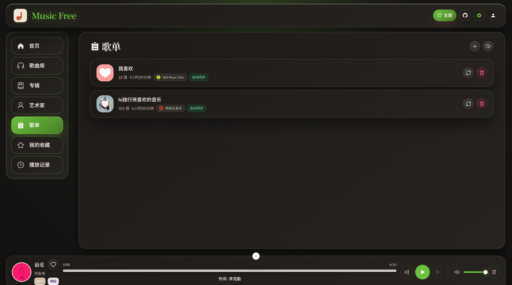
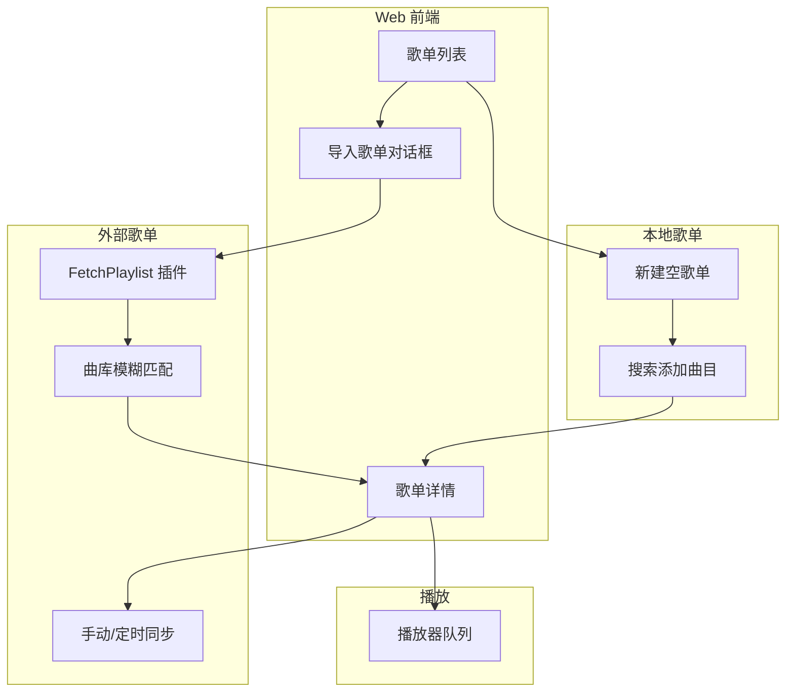
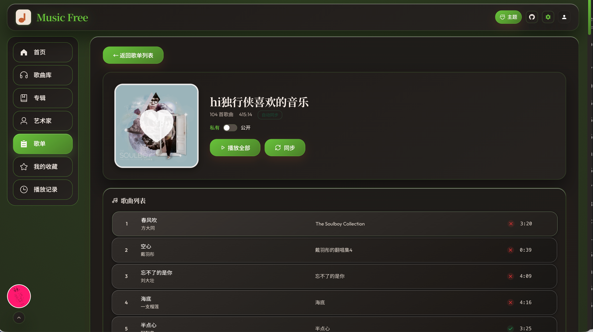

# 歌单

相关文档：[音乐管理](/music) · [插件合集](/plugin-collection) · [用户](/user) · [OpenSubsonic API](/opensubsonic-api)



## 1. 模块概述

**歌单模块**用于创建、浏览与管理用户歌单，并支持从外部平台（网易云、QQ 音乐等）**按链接导入**歌单、与本地曲库**匹配**后播放。核心入口：

| 入口     | 路径             | 侧栏名称       |
| -------- | ---------------- | -------------- |
| 歌单列表 | `/playlists`     | 歌单           |
| 歌单详情 | `/playlists/:id` | （从列表进入） |



歌单数据按 **用户** 隔离；可将歌单设为 **公开**，供同服务器其他用户浏览（不可编辑他人歌单）

## 2. 访问与权限

- **入口**：登录后访问 `/playlists`。
- **可见范围**：列表包含 **本人歌单** + **他人公开歌单**（`isPublic: true`）。
- **编辑权限**（`canEdit`）：仅歌单 **所有者** 可改名、删歌单、增删曲目、同步、切换公开状态；导入的外部歌单对所有者只读曲目列表（见下文）。
- **OpenSubsonic**：客户端通过 `getPlaylists` / `getPlaylist` 访问同一套数据；管理员可用 `username` 参数查询指定用户的歌单列表。

## 3. 歌单类型

| 类型                 | 曲目来源                               | 手动增删曲                         |
| -------------------- | -------------------------------------- | ---------------------------------- |
| **自建歌单**         | 用户在详情页搜索曲库添加               | 支持                               |
| **导入歌单**         | 插件拉取平台列表后与本地匹配           | **不支持**（只读；用「同步」更新） |
| **系统歌单**（预留） | 如每日推荐（规划能力，数据模型已预留） | 由系统维护                         |

列表卡片上会显示来源平台图标/名称，以及 **「自动同步」** 徽章（`syncEnabled: true` 时）。

## 4. 歌单列表（/playlists）

### 4.1 能做什么

- 查看全部可见歌单：封面、名称、曲目数、总时长、公开/来源/自动同步标签。
- **新建歌单**：输入名称即可创建空歌单。
- **导入歌单**：打开导入对话框，选择插件、粘贴平台歌单链接，可选自定义名称与是否开启自动同步。
- **同步**（仅导入歌单且可编辑）：从来源平台重新拉取曲目并刷新匹配结果。
- **删除**（仅可编辑歌单）：删除歌单及其条目（不删除本地音频文件）。

### 4.2 导入歌单流程

1. 点击 **导入歌单**。
2. 选择实现了 **`FetchPlaylist`** 的已启用插件（界面自动筛选）。
3. 粘贴歌单分享链接（如网易云 `https://music.163.com/#/playlist?id=...`）。
4. 可选填写本地显示名称；勾选 **启用自动同步** 后，服务器约每 **6 小时** 自动重新同步该歌单。
5. 导入完成后展示摘要：**总数 / 已匹配 / 未匹配**；未匹配曲目会列出标题、艺术家与原因。

## 5. 歌单详情（/playlists/:id）



### 5.1 头部信息

- 封面、名称、曲目数、总时长、备注（`comment`）。
- 来源平台标识（如「网易云音乐」）。
- **公开 / 私有** 开关（仅所有者可改）。
- **播放全部**：将歌单中 **可播放** 条目依次加入播放器队列并开始播放。
- **同步**（导入歌单）：重新执行平台拉取与本地匹配，并提示匹配统计。

### 5.2 曲目列表

每条记录包含：

| 字段                 | 说明                                          |
| -------------------- | --------------------------------------------- |
| 序号                 | 歌单内顺序（`position`）                      |
| 标题 / 艺术家 / 专辑 | 展示用元数据                                  |
| 可播放状态           | ✓ 已匹配本地曲库；✗ 未匹配（显示原因）        |
| 时长                 | 匹配条目用 `songs.duration`，未匹配用外部时长 |

**播放规则**：

- 仅 `playable: true` 且存在 `songId` 的条目可点击播放。
- 未匹配条目仍保留在列表中，便于对照补库；悬停/提示可查看 `unavailableReason`（如未在本地找到）。

**管理操作**（仅 **自建歌单** 且可编辑）：

- **+ 添加歌曲**：搜索曲库，多选后加入歌单末尾。
- **移除**：从歌单删除已匹配的本地曲目（不删磁盘文件）。

导入歌单若尝试手动添加/移除，接口会返回只读错误，提示使用同步功能。

## 6. 平台同步与本地匹配

### 6.1 匹配逻辑

导入或同步时，对平台返回的每一首曲目：

1. 在本地 `songs` 表中按 **标题 + 艺术家**（归一化后精确匹配）查找。
2. **匹配成功**：写入 `playlist_songs`，关联 `song_id`，`playable: true`。
3. **匹配失败**：仍写入一条 **占位条目**，保存外部标题/艺术家/专辑/时长与 `external_song_id`，`playable: false`。

同步会 **先清空** 该歌单下旧条目，再按平台最新曲目列表重建（顺序与平台一致）。

### 6.2 手动同步 vs 自动同步

| 方式 | 触发                                                                                              |
| ---- | ------------------------------------------------------------------------------------------------- |
| 手动 | 列表或详情页点击 **同步**                                                                         |
| 自动 | 创建/导入时勾选「启用自动同步」；服务端定时任务默认 **每 6 小时** 扫描 `sync_enabled=true` 的歌单 |

同一歌单同步进行中会加锁，避免并发重复请求；同一用户、插件、URL 的重复导入有短冷却（约 10 秒）。

### 6.3 提高匹配率

未匹配曲目通常因本地曲库缺少对应文件或标签不一致。可：

- 在 **[音乐管理](/music)** 搜索下载缺失歌曲后再次同步；
- 修正本地曲目的标题/艺术家标签后重新同步；
- 使用 **[音乐刮削](/music)** 统一元数据。

## 7. 公开歌单与多用户

- 自建歌单默认 **私有**；所有者可切换为 **公开**，其他登录用户可在列表中看到并打开详情。
- 他人公开歌单 **不可编辑**、不可同步、不可删除。
- OpenSubsonic `getPlaylists` 返回 `public`、`owner` 等字段；`getPlaylist` 对无权限的私有歌单返回权限错误。

## 8. OpenSubsonic 与第三方客户端

| 接口           | 用途                                            |
| -------------- | ----------------------------------------------- |
| `getPlaylists` | 当前用户（或管理员指定 `username`）可见歌单列表 |
| `getPlaylist`  | 歌单详情 + `entry` 曲目（含未匹配占位 stub）    |
| `getCoverArt`  | `id=pl-{playlistId}` 歌单封面                   |

Navidrome 兼容 REST（实验性）：

- `GET /api/playlist` — 列表
- `GET /api/playlist/:id/tracks` — 仅 **可播放** 曲目（用于 Navidrome UI）
- `DELETE /api/playlist/:id` — 删除

## 9. 典型工作流

### 9.1 自建精选歌单

```text
/playlists → 新建歌单
    → 进入详情 → 「+ 添加歌曲」搜索曲库
    → 播放全部或单曲播放
```

### 9.2 从网易云导入并定期更新

```text
启用 mf-plugin-netease
    → 导入歌单 → 粘贴链接 → 勾选自动同步
    → 查看未匹配列表 → 补库后再次「同步」
```

### 9.3 客户端使用同一歌单

```text
Feishin 等连接 OpenSubsonic
    → getPlaylists / getPlaylist
    → 仅可播放条目可 stream；未匹配条目以 stub 形式出现（依客户端实现）
```

---

## 10. 常见问题

**Q：导入后很多歌不能播放？**  
A：这些多为 **未匹配** 条目，本地没有对应音频。补全曲库或修正标签后执行 **同步**。

**Q：为什么不能从导入歌单里删歌或加歌？**  
A：导入歌单以平台为准，曲目列表 **只读**；请在原平台改歌单后在本站 **同步**，或改用自建歌单手动维护。

**Q：自动同步多久一次？**  
A：服务端默认 **每 6 小时** 处理所有 `syncEnabled` 的歌单；也可随时手动点同步。

**Q：公开歌单别人能改吗？**  
A：不能。仅所有者可编辑与同步。

**Q：和音乐/专辑模块如何配合？**  
A：歌单只引用已有 `songs`，不直接操作文件。
