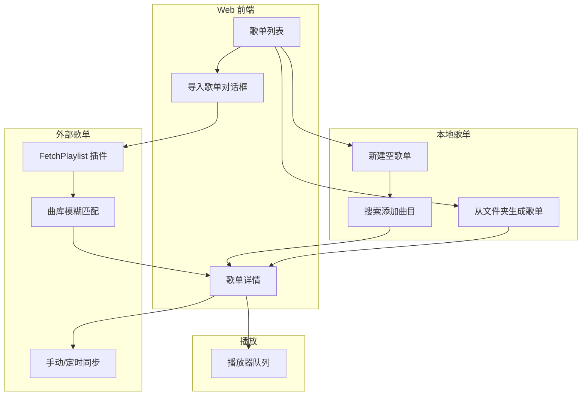

# 歌单

相关文档：[音乐管理](/music) · [插件合集](/plugin-collection) · [用户](/user) · [OpenSubsonic API](/opensubsonic-api)


## 1. 模块概述

**歌单模块**用于创建、浏览与管理用户歌单，并支持从外部平台（网易云、QQ 音乐等）**按链接导入**歌单、与本地曲库**匹配**后播放。管理员还可按**音乐文件夹**一键生成快照歌单（见 [4.3](#43-从文件夹一键生成歌单管理员)）；启用 [MusicFreeServe 集成](/serve) 后，还可进行**歌单同步、共享、订阅**与**发现歌单**浏览（见 [8](#8-与-musicfreeserve-集成)）。核心入口：

歌单页包含四个页签：**推荐** / **我的歌单** / **发现歌单** / **共享歌单**（未启用 MusicFreeServe 时默认落到「我的歌单」）。

| 入口     | 路径             | 侧栏名称       |
| -------- | ---------------- | -------------- |
| 歌单列表 | `/playlists`     | 歌单           |
| 歌单详情 | `/playlists/:id` | （从列表进入） |


```mermaid
flowchart TB
  subgraph ui [Web 前端]
    L[歌单列表]
    D[歌单详情]
    I[导入歌单对话框]
  end
  subgraph local [本地歌单]
    C[新建空歌单]
    A[搜索添加曲目]
    F[从文件夹生成歌单]
  end
  subgraph external [外部歌单]
    P[FetchPlaylist 插件]
    M[曲库模糊匹配]
    S[手动/定时同步]
  end
  subgraph play [播放]
    Q[播放器队列]
  end
  L --> C
  L --> F --> D
  L --> I
  I --> P
  P --> M
  M --> D
  C --> A --> D
  D --> S
  D --> Q
```

歌单数据按 **用户** 隔离；可将歌单设为 **公开**，供同服务器其他用户浏览（不可编辑他人歌单）

## 2. 访问与权限

- **入口**：登录后访问 `/playlists`。
- **可见范围**：列表包含 **本人歌单** + **他人公开歌单**（`isPublic: true`）。
- **编辑权限**（`canEdit`）：仅歌单 **所有者** 可改名、删歌单、增删曲目、同步、切换公开状态；导入的外部歌单对所有者只读曲目列表（见下文）。
- **只读限制**：**订阅歌单**（`external_source` 为 `serve-shared` / `serve-discovery`）对所有者为只读；**共享中的歌单**（`share_enabled=1`）在关闭共享前也不可编辑、改名或增删曲目。
- **OpenSubsonic**：客户端通过 `getPlaylists` / `getPlaylist` 访问同一套数据；管理员可用 `username` 参数查询指定用户的歌单列表。

## 3. 歌单类型

| 类型                 | 曲目来源                               | 手动增删曲                         |
| -------------------- | -------------------------------------- | ---------------------------------- |
| **自建歌单**         | 用户在详情页搜索曲库添加               | 支持                               |
| **导入歌单**         | 插件拉取平台列表后与本地匹配           | **不支持**（只读；用「同步」更新） |
| **文件夹生成歌单**   | 管理员指定音乐源与文件夹，一键生成快照 | **不支持**（快照式；重新生成即更新） |
| **订阅歌单**         | 订阅 serve 共享歌单 / 发现库歌单后导入 | **不支持**（只读；可「同步」刷新） |
| **系统歌单**（预留） | 如每日推荐（规划能力，数据模型已预留） | 由系统维护                         |

列表卡片上会显示来源平台图标/名称，以及 **「自动同步」** 徽章（`syncEnabled: true` 时）。文件夹生成的歌单名称默认取文件夹名。

> **订阅歌单只读**：由 serve 共享歌单（`external_source=serve-shared`）或发现库（`external_source=serve-discovery`）订阅而来的副本对本地只读，需在来源平台更新后「同步」刷新；远程关闭共享后会自动转为自有可编辑歌单。

## 4. 歌单列表（/playlists）

### 4.1 能做什么

- 查看全部可见歌单：封面、名称、曲目数、总时长、公开/来源/自动同步标签。
- **新建歌单**：输入名称即可创建空歌单。
- **从文件夹生成歌单**（管理员）：指定音乐源与文件夹路径，一键将文件夹下的歌曲生成为一张歌单（见 [4.3](#43-从文件夹一键生成歌单管理员)）。
- **导入歌单**：打开导入对话框，选择插件、粘贴平台歌单链接，可选自定义名称与是否开启自动同步。
- **同步**（仅导入歌单且可编辑）：从来源平台重新拉取曲目并刷新匹配结果。
- **删除**（仅可编辑歌单）：删除歌单及其条目（不删除本地音频文件）。

### 4.2 导入歌单流程

1. 点击 **导入歌单**。
2. 选择实现了 **`FetchPlaylist`** 的已启用插件（界面自动筛选）。
3. 粘贴歌单分享链接（如网易云 `https://music.163.com/#/playlist?id=...`）。
4. 可选填写本地显示名称；勾选 **启用自动同步** 后，服务器约每 **6 小时** 自动重新同步该歌单。
5. 导入完成后展示摘要：**总数 / 已匹配 / 未匹配**；未匹配曲目会列出标题、艺术家与原因。

### 4.3 从文件夹一键生成歌单（管理员）

管理员可在歌单列表页指定 **音乐源** 与 **文件夹路径**，一键将该文件夹下的歌曲生成为一张歌单：

- **快照式**：仅包含该文件夹 **直属** 的音乐文件，**不递归** 子文件夹；
- **命名**：歌单名默认取 **文件夹名**，也可手动指定；
- **适用场景**：把按歌手、专辑、语种等整理的目录结构快速固化为歌单，方便后续播放与分享；
- **只读**：生成结果按生成时快照保存，如需更新则重新指定文件夹生成。


## 5. 歌单详情（/playlists/:id）


### 5.1 头部信息

- 封面、名称、曲目数、总时长、备注（`comment`）。
- 来源平台标识（如「网易云音乐」）。
- **公开 / 私有** 开关（仅所有者可改）。
- **播放全部**：将歌单中 **可播放** 条目依次加入播放器队列并开始播放。
- **同步**（导入歌单）：重新执行平台拉取与本地匹配，并提示匹配统计。

### 5.2 曲目列表

每条记录包含：

| 字段                 | 说明                                          |
| -------------------- | --------------------------------------------- |
| 序号                 | 歌单内顺序（`position`）                      |
| 标题 / 艺术家 / 专辑 | 展示用元数据                                  |
| 可播放状态           | ✓ 已匹配本地曲库；✗ 未匹配（显示原因）        |
| 时长                 | 匹配条目用 `songs.duration`，未匹配用外部时长 |

**播放规则**：

- 仅 `playable: true` 且存在 `songId` 的条目可点击播放。
- 未匹配条目仍保留在列表中，便于对照补库；悬停/提示可查看 `unavailableReason`（如未在本地找到）。

**管理操作**（仅 **自建歌单** 且可编辑）：

- **+ 添加歌曲**：搜索曲库，多选后加入歌单末尾。
- **移除**：从歌单删除已匹配的本地曲目（不删磁盘文件）。

导入歌单若尝试手动添加/移除，接口会返回只读错误，提示使用同步功能。

### 5.3 未匹配曲目许愿（外部歌单）

对 **平台导入** 且 `playable: false` 的条目，详情页提供 **歌曲许愿** 能力（完整说明见 [许愿](/wish)）：

| 操作               | 说明                                                          |
| ------------------ | ------------------------------------------------------------- |
| 行内 **许愿**      | 为单首未匹配曲目提交愿望；已提交显示 **已许愿**               |
| **许愿全部未匹配** | 批量为当前歌单所有未匹配且尚未许愿的条目创建愿望              |
| `wishStatus`       | 歌单 API 返回 `none` / `wished` / `fulfilled`（相对当前用户） |

许愿不会触发播放。管理员在 **`/admin/wish`** 检索下载入库后，可尝试 **同步歌单** 以完成本地匹配。

## 6. 平台同步与本地匹配

### 6.1 匹配逻辑

导入或同步时，对平台返回的每一首曲目：

1. 在本地 `songs` 表中按 **标题 + 艺术家**（归一化后精确匹配）查找。
2. **匹配成功**：写入 `playlist_songs`，关联 `song_id`，`playable: true`。
3. **匹配失败**：仍写入一条 **占位条目**，保存外部标题/艺术家/专辑/时长与 `external_song_id`，`playable: false`。

同步会 **先清空** 该歌单下旧条目，再按平台最新曲目列表重建（顺序与平台一致）。

### 6.2 手动同步 vs 自动同步

| 方式 | 触发                                                                                              |
| ---- | ------------------------------------------------------------------------------------------------- |
| 手动 | 列表或详情页点击 **同步**                                                                         |
| 自动 | 创建/导入时勾选「启用自动同步」；服务端定时任务默认 **每 6 小时** 扫描 `sync_enabled=true` 的歌单 |

同一歌单同步进行中会加锁，避免并发重复请求；同一用户、插件、URL 的重复导入有短冷却（约 10 秒）。

### 6.3 提高匹配率

未匹配曲目通常因本地曲库缺少对应文件或标签不一致。可：

- 在 **[音乐管理](/music)** 搜索下载缺失歌曲后再次同步；
- 修正本地曲目的标题/艺术家标签后重新同步；
- 使用 **[音乐刮削](/music)** 统一元数据。
- 由用户在外部歌单详情 **[许愿](/wish)**，管理员在 **愿望管理** 统一检索下载；

## 7. 公开歌单与多用户

- 自建歌单默认 **私有**；所有者可切换为 **公开**，其他登录用户可在列表中看到并打开详情。
- 他人公开歌单 **不可编辑**、不可同步、不可删除。
- OpenSubsonic `getPlaylists` 返回 `public`、`owner` 等字段；`getPlaylist` 对无权限的私有歌单返回权限错误。

## 8. 与 MusicFreeServe 集成

启用 [MusicFreeServe 集成](/serve)（在「用户配置」中填写 serve 地址与 API Key 并勾选启用）后，歌单模块新增以下能力。它们依赖 `serve.sync_playlist` 开关与远程 `music-free-serve` 服务。

### 8.1 歌单同步（发布方）

开启 `sync_playlist` 后，本用户的**公开歌单**（`is_public=1`）会同步到 serve：

- **增量同步**：新建 / 更新 / 删除歌单时自动推送；
- **全量对账**：服务端每 **8 小时** 兜底核对一次，避免状态漂移；
- **ID 映射**：本地与远程歌单 ID 的映射自动维护。

### 8.2 歌单共享（发布方）

在歌单详情页点击 **共享** 可开启：

- **可见性**：`unlisted`（仅凭共享码可见）或 `public`（公开可见）；
- **共享码**：开启后自动生成，可复制分享给他人；
- **只读**：共享中的歌单不可编辑（改名、备注、公开开关、封面、增删曲目均被拒绝），需先**关闭共享**再编辑；
- 关闭共享会作废共享码，并清理远程订阅关系。

### 8.3 共享歌单订阅（接收方）

「歌单 → **共享歌单**」页签列出 serve 上的公开共享歌单（封面、名称、创建者、曲目数、订阅数）：

- 支持**关键词搜索**与**分页**；
- 点击卡片进入共享歌单详情，可查看曲目并 **订阅**；
- 订阅会在本地创建 `external_source=serve-shared` 的只读副本，并回传订阅数。

### 8.4 共享码订阅

「共享歌单」页签的 **共享码订阅** 按钮：输入他人分享的共享码即可：

- 解析并预览歌单详情（支持不可见 `unlisted` 歌单）；
- 一键订阅，同样生成本地只读副本。

### 8.5 发现歌单

「歌单 → **发现歌单**」页签浏览 serve 发现库：

- 按**平台 / 分类**筛选，支持**关键词检索**；
- 订阅后导入为本地歌单（`external_source=serve-discovery`），按**标题 + 艺术家**匹配本地曲库，未匹配条目保留在歌单中。

### 8.6 推荐页

歌单页默认进入 **推荐** 页签，包含两个区块：

- **热门歌单**：聚合各平台热度榜单；
- **推荐歌单**：公开共享歌单预览，可跳转到「共享歌单」页签查看更多。

> serve 不可用时，「推荐 / 发现歌单 / 共享歌单」面板会**静默显示空列表**，不弹出错误提示。

---

## 9. OpenSubsonic 与第三方客户端

| 接口           | 用途                                            |
| -------------- | ----------------------------------------------- |
| `getPlaylists` | 当前用户（或管理员指定 `username`）可见歌单列表 |
| `getPlaylist`  | 歌单详情 + `entry` 曲目（含未匹配占位 stub）    |
| `getCoverArt`  | `id=pl-{playlistId}` 歌单封面                   |

Navidrome 兼容 REST（实验性）：

- `GET /api/playlist` — 列表
- `GET /api/playlist/:id/tracks` — 仅 **可播放** 曲目（用于 Navidrome UI）
- `DELETE /api/playlist/:id` — 删除

## 10. 典型工作流

### 9.1 自建精选歌单

```text
/playlists → 新建歌单
    → 进入详情 → 「+ 添加歌曲」搜索曲库
    → 播放全部或单曲播放
```

### 9.2 从网易云导入并定期更新

```text
启用 mf-plugin-netease
    → 导入歌单 → 粘贴链接 → 勾选自动同步
    → 查看未匹配列表 → 补库后再次「同步」
```

### 9.3 客户端使用同一歌单

```text
Feishin 等连接 OpenSubsonic
    → getPlaylists / getPlaylist
    → 仅可播放条目可 stream；未匹配条目以 stub 形式出现（依客户端实现）
```

### 9.4 从文件夹快速固化为歌单（管理员）

```text
/playlists → 「从文件夹生成歌单」
    → 选择音乐源 + 文件夹路径（可选修改歌单名，默认文件夹名）
    → 生成快照歌单 → 播放或分享
```

### 9.5 共享歌单给他人（发布方）

```text
在用户配置启用 MusicFreeServe 与「歌单同步」
    → 打开歌单详情 → 「共享」→ 选择 unlisted / public
    → 复制共享码发给他人（关闭共享后需先关闭才能再编辑）
```

### 9.6 订阅他人的共享 / 发现歌单（接收方）

```text
/playlists → 「共享歌单」页签搜索，或「共享码订阅」输入共享码
    → 进入详情 → 「订阅」→ 生成只读副本
    → 或将「发现歌单」页签的远程歌单订阅导入本地曲库
```

---

## 11. 常见问题

**Q：导入后很多歌不能播放？**  
A：这些多为 **未匹配** 条目，本地没有对应音频。补全曲库或修正标签后执行 **同步**。

**Q：为什么不能从导入歌单里删歌或加歌？**  
A：导入歌单以平台为准，曲目列表 **只读**；请在原平台改歌单后在本站 **同步**，或改用自建歌单手动维护。

**Q：自动同步多久一次？**  
A：服务端默认 **每 6 小时** 处理所有 `syncEnabled` 的歌单；也可随时手动点同步。

**Q：公开歌单别人能改吗？**  
A：不能。仅所有者可编辑与同步。

**Q：如何把某个文件夹里的歌快速变成一张歌单？**  
A：管理员在歌单列表页使用「从文件夹生成歌单」，指定音乐源与文件夹路径即可一键生成；结果按生成时快照保存（仅含该文件夹直属文件，不递归子文件夹），歌单名默认取文件夹名。

**Q：和音乐/专辑模块如何配合？**  
A：歌单只引用已有 `songs`，不直接操作文件。

**Q：为什么共享中的歌单不能编辑？**  
A：共享歌单要求本地与远程保持一致，为避免状态漂移会锁定编辑；请先**关闭共享**再修改。

**Q：订阅的歌单能自己改吗？**  
A：不能。订阅生成的副本为只读，需在来源平台更新后「同步」；若远程关闭了共享，本地副本会在打开或同步时自动转为可编辑的自有歌单。

**Q：推荐 / 共享 / 发现歌单是空的？**  
A：这些页签依赖 `music-free-serve`。请先在「用户配置」中启用并正确配置 serve；服务不可用时会显示为空列表。
