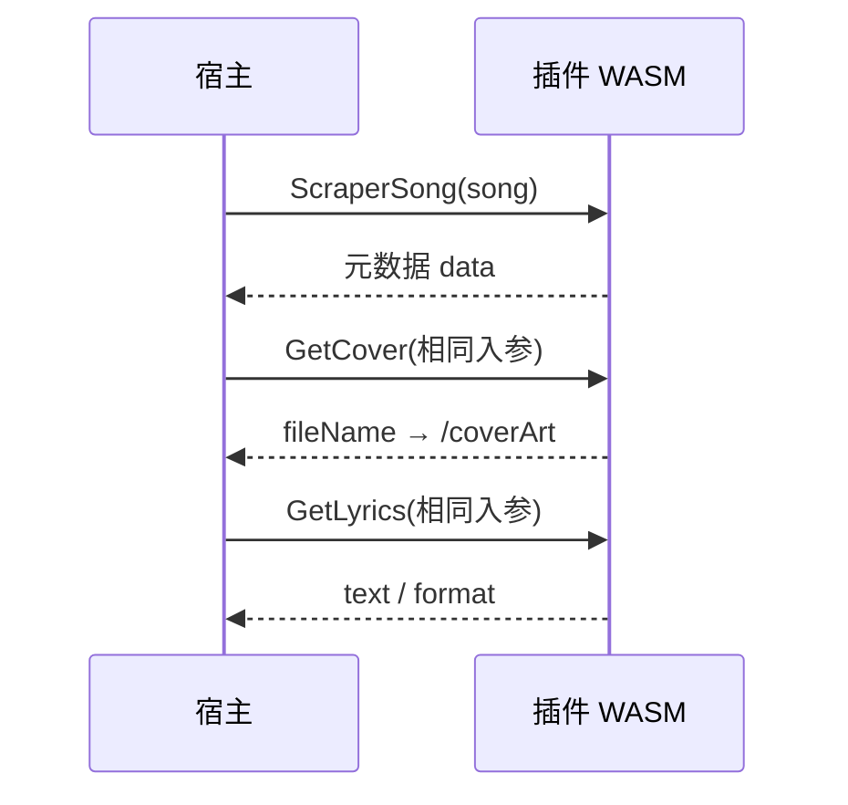

# MusicFree 插件开发文档

MusicFree插件系统基于[Extism WASI WASM](https://extism.org/)实现的插件系统。

## 1. 开发前提

| 项       | 说明                                                             |
| -------- | ---------------------------------------------------------------- |
| 宿主     | MusicFree 服务器                                                 |
| 插件形态 | WASI WASM                                                        |
| 必需文件 | `manifest.json` + `entry.wasmPath` 指向的 `.wasm`                |
| 参考实现 | [music-free-plugin](https://github.com/AnsGoo/music-free-plugin) |

## 2. Manifest 规范

```json
{
  "name": "mf-plugin-demo",
  "title": "Demo Plugin",
  "version": "0.1.0",
  "author": "you",
  "repo": "https://example.com/repo",
  "icon": "icon.svg",
  "type": "scraper",
  "description": "Demo scraper plugin",
  "entry": {
    "wasmPath": "plugin.wasm",
    "exportedFunctions": {
      "scraperSong": "ScraperSong",
      "getCover": "GetCover",
      "getLyrics": "GetLyrics",
      "getAlbumInfo": "GetAlbumInfo",
      "getArtistInfo": "GetArtistInfo",
      "fetchPlaylist": "FetchPlaylist",
      "remoteSearch": "RemoteSearch",
      "remoteDownload": "RemoteDownload"
    }
  },
  "config": {
    "fields": {
      "apiKey": {
        "type": "string",
        "required": true
      }
    }
  }
}
```

**校验要点**

- `name`：`^[a-z][a-z0-9_-]{1,63}$`，且与插件目录名一致
- `entry.wasmPath`：相对路径，禁止 `..` 穿越
- `icon`：本地文件须为单文件名（无路径），可为远程 URL
- `exportedFunctions`：按实际实现的能力声明即可，未实现的键可省略

**`exportedFunctions` 映射**

| manifest 键      | WASM 导出名      | 说明           |
| ---------------- | ---------------- | -------------- |
| `scraperSong`    | `ScraperSong`    | 单曲元数据刮削 |
| `getCover`       | `GetCover`       | 获取歌曲封面   |
| `getLyrics`      | `GetLyrics`      | 或缺歌曲歌词   |
| `getAlbumInfo`   | `GetAlbumInfo`   | 获取专辑信息   |
| `getArtistInfo`  | `GetArtistInfo`  | 获取艺术家信息 |
| `fetchPlaylist`  | `FetchPlaylist`  | 歌单解析       |
| `remoteSearch`   | `RemoteSearch`   | 远程搜索       |
| `remoteDownload` | `RemoteDownload` | 远程下载       |

## 3. 通信协议

### 3.1 版本与传输

- 协议版本：`apiVersion = "musicfree.plugin.scraper.v1"`
- 入参 / 出参：UTF-8 **JSON 文本**（经 Extism 传入 WASM）
- 超时：读取 `context.timeoutMs`；宿主若带 deadline，会按**剩余毫秒**覆盖默认值

### 3.2 响应

成功：

```json
{
  "ok": true,
  "data": {}
}
```

失败：

```json
{
  "ok": false,
  "error": {
    "code": "no_match",
    "message": "not found",
    "retryable": false,
    "details": {}
  }
}
```

| `error.code`      | 典型场景       | `retryable` |
| ----------------- | -------------- | ----------- |
| `no_match`        | 未匹配到结果   | `false`     |
| `invalid_config`  | 配置缺失或无效 | `false`     |
| `invalid_request` | 入参不合法     | `false`     |
| `rate_limited`    | 平台限流 / 429 | 建议 `true` |
| `network`         | 网络错误       | 视情况      |
| `timeout`         | 超时           | 视情况      |
| `internal`        | 插件内部错误   | `false`     |

### 3.3 输入骨架 `ScraperCallInput`

各函数按需填充子集；**下文 §5 示例在省略 `apiVersion` / `config` 时，实际调用仍须带上二者**（值与当前插件配置一致）。

```json
{
  "apiVersion": "musicfree.plugin.scraper.v1",
  "config": {},
  "song": { "title": "", "artist": "", "album": "" },
  "album": { "albumName": "", "albumArtist": "" },
  "artist": { "artistName": "" },
  "playlist": { "url": "" },
  "remoteSong": {},
  "context": {
    "songId": "",
    "language": "",
    "timeoutMs": 20000
  }
}
```

### 3.4 本地封面文件名 {#local-cover}

凡需返回「已落盘封面」的字段（如 `GetCover` 的 `fileName`、`GetAlbumInfo` 的 `albumCover`、`GetArtistInfo` 的 `artistAvatar`）：

1. 先将图片写入宿主映射目录 **`/coverArt`**
2. 再返回文件名：`sha256-<64位小写hex>.(jpg|jpeg|png|webp)`
3. **禁止**用 `http(s)` URL 冒充本地文件

## 4. 能力一览与调用关系

| 函数             | 默认 `timeoutMs` | 主要用途                                        |
| ---------------- | ---------------: | ----------------------------------------------- |
| `ScraperSong`    |            20000 | 单曲元数据刮削                                  |
| `GetCover`       |            20000 | 封面（与当次 `ScraperSong` **同一份**入参字节） |
| `GetLyrics`      |            20000 | 歌词（同上）                                    |
| `GetAlbumInfo`   |            20000 | 专辑页信息                                      |
| `GetArtistInfo`  |            20000 | 艺人页信息                                      |
| `FetchPlaylist`  |            30000 | 外链歌单解析                                    |
| `RemoteSearch`   |            45000 | 远程曲库搜索                                    |
| `RemoteDownload` |            60000 | 下载到 `/cache` 并入库                          |

单曲刮削链路（宿主在一次请求中可能依次调用）：



## 5. 各函数数据约定

### 5.1 `ScraperSong`

宿主在 `ScrapeSong` **严格模式**下必须先成功调用。`song` 来自曲库（标题 / 艺人 / 专辑）。

**入参**

```json
{
  "apiVersion": "musicfree.plugin.scraper.v1",
  "config": {},
  "song": {
    "title": "xxxx",
    "artist": "xxxx",
    "album": ""
  },
  "context": { "timeoutMs": 20000 }
}
```

**出参 `data`**

```json
{
  "title": "Song Title",
  "artist": "Artist",
  "album": "Album",
  "genre": "",
  "year": 2024,
  "track": 1,
  "discNumber": 1
}
```

### 5.2 `GetCover`

**入参**：与当次 `ScraperSong` 完全相同（`config`、`song`、`context` 等）。

```json
{
  "apiVersion": "musicfree.plugin.scraper.v1",
  "config": {},
  "song": {
    "title": "xxxx",
    "artist": "xxxx",
    "album": ""
  },
  "context": { "timeoutMs": 20000 }
}
```

**出参 `data`**

```json
{
  "fileName": "sha256-<64位小写hex>.jpg",
  "mimeType": "image/jpeg"
}
```

须满足 [§3.4 本地封面文件名](#local-cover)。

### 5.3 `GetLyrics`

**入参**：同 `GetCover`（共用单次刮削的输入字节）。

```json
{
  "apiVersion": "musicfree.plugin.scraper.v1",
  "config": {},
  "song": {
    "title": "xxxx",
    "artist": "xxxx",
    "album": ""
  },
  "context": { "timeoutMs": 20000 }
}
```

**出参 `data`**

```json
{
  "text": "[00:00.00] ...",
  "format": "lrc"
}
```

### 5.4 `GetAlbumInfo`

**入参**

```json
{
  "apiVersion": "musicfree.plugin.scraper.v1",
  "config": {},
  "album": {
    "albumName": "Album Name",
    "albumArtist": "Album Artist"
  },
  "context": { "timeoutMs": 20000 }
}
```

未知 `albumArtist` 会被宿主归一化为空字符串。

**出参 `data`**

```json
{
  "albumName": "",
  "albumArtist": "",
  "albumCover": "",
  "albumReleaseDate": "",
  "albumIntroduction": ""
}
```

`albumCover` 非空时须为 [§3.4](#local-cover) 规定的本地文件名。

### 5.5 `GetArtistInfo`

**入参**

```json
{
  "apiVersion": "musicfree.plugin.scraper.v1",
  "config": {},
  "artist": { "artistName": "Artist Name" },
  "context": { "timeoutMs": 20000 }
}
```

**出参 `data`**：二选一

- 单条对象：`artistName`、`artistAvatar`、`artistIntroduction`、`nationality`
- 或多候选：`{ "candidates": [ { ... }, ... ] }`

`artistAvatar` 非空时遵循 [§3.4](#local-cover)。

### 5.6 `FetchPlaylist`

**入参**

```json
{
  "apiVersion": "musicfree.plugin.scraper.v1",
  "config": {},
  "playlist": { "url": "https://..." },
  "context": { "timeoutMs": 30000 }
}
```

**出参 `data`**

```json
{
  "platform": "",
  "playlistId": "",
  "name": "",
  "description": "",
  "coverUrl": "",
  "coverArt": "",
  "sourceUrl": "",
  "tracks": [
    {
      "id": "",
      "title": "",
      "artist": "",
      "album": "",
      "duration": 0
    }
  ]
}
```

### 5.7 `RemoteSearch`

宿主传顶层 **`keyword`**，并同步写入 `song.title`。

**入参**

```json
{
  "apiVersion": "musicfree.plugin.scraper.v1",
  "config": {},
  "song": { "title": "搜索关键词" },
  "context": { "timeoutMs": 45000 }
}
```

**出参 `data`**：歌曲数组，或 `{ "songs": [ ... ] }`。单条推荐字段：

| 字段                         | 说明                                            |
| ---------------------------- | ----------------------------------------------- |
| `title` / `artist` / `album` | 展示与匹配                                      |
| `platform`                   | 来源平台                                        |
| `bitrate`                    | kbps                                            |
| `format`                     | 如 `mp3`、`flac`                                |
| `quality`                    | 如 `320k`、`Hi-Res`                             |
| `durationSec`                | 时长（秒）                                      |
| `coverUrl`                   | 封面 URL                                        |
| `raw`                        | 平台原始对象；可选放入 `downloadUrl` 等扩展字段 |

示例：

```json
[
  {
    "title": "",
    "artist": "",
    "album": "",
    "platform": "",
    "bitrate": 320,
    "format": "mp3",
    "quality": "",
    "durationSec": 0,
    "coverUrl": "",
    "raw": {}
  }
]
```

### 5.8 `RemoteDownload`

**入参**：`remoteSong` 为前端/API 传入的完整 `record`。

```json
{
  "apiVersion": "musicfree.plugin.scraper.v1",
  "config": {},
  "song": { "title": "", "artist": "", "album": "" },
  "remoteSong": {
    "title": "",
    "artist": "",
    "album": "",
    "platform": "",
    "bitrate": 0,
    "format": "",
    "quality": "",
    "durationSec": 0,
    "coverUrl": "",
    "raw": {}
  },
  "context": { "timeoutMs": 60000 }
}
```

**出参 `data`**

```json
{
  "cachePath": "/cache/....",
  "coverPath": "",
  "metadata": {
    "title": "",
    "artist": "",
    "artists": [],
    "album": "",
    "releaseDate": "",
    "coverUrl": "",
    "lyrics": "",
    "lyricsFormat": ""
  }
}
```

| 字段        | 说明                                                                    |
| ----------- | ----------------------------------------------------------------------- |
| `cachePath` | **必填**（或兼容 `filePath` / `localFilePath`）；宿主据此读取音频并入库 |
| `coverPath` | 可选；插件可访问的封面路径                                              |
| `metadata`  | 可选；入库用补充元数据                                                  |

音频与临时文件应写入 **`/cache`**。

## 6. 运行时权限与最佳实践

**宿主提供**

| 能力        | 说明               |
| ----------- | ------------------ |
| HTTP        | 由宿主管控出站请求 |
| `/coverArt` | 封面持久化目录     |
| `/cache`    | 插件缓存与下载目录 |

**建议**

- 所有外部请求遵守 `context.timeoutMs`
- 配置缺失时返回 `invalid_config`
- 限流 / 429 使用 `rate_limited` 且 `retryable: true`
- 控制 `/cache` 体积，避免无限增长

## 7. 开发

你可以使用你熟悉的任何语言开发插件，但是有几条规则你必须遵守

- 所有的HTTP请求，必须使用`PDK`提供的HTTP客户端
- 只能访问 `/coverArt`和/`cache`目录

| 语言       | 示例目录                                                 |
| ---------- | -------------------------------------------------------- |
| Python     | `plugin/mf-plugin-lastfm/`                               |
| Go         | `plugin/mf-plugin-spotify/`、`plugin/mf-plugin-qqmusic/` |
| Rust       | `plugin/mf-plugin-netease/`                              |
| TypeScript | `plugin/mf-plugin-apple-music/`                          |

以下各节结构一致：**环境搭建 → manifest 与示例代码（以 `ScraperSong` 为例）→ 构建 → 打包安装**。

---

### 通用约定（所有语言）

1. **目录名** 必须等于 `manifest.json` 中的 `name`（如 `mf-plugin-demo`）。
2. **导出函数名** 在 WASM 中一般为 PascalCase（如 `ScraperSong`），在 manifest 的 `exportedFunctions` 里用 camelCase 键映射（如 `"scraperSong": "ScraperSong"`）。
3. **输入输出** 均为 UTF-8 JSON，统一 envelope：
   - 输入需包含 `apiVersion: "musicfree.plugin.scraper.v1"`，以及 `config`、`song` 等字段。
   - 成功：`{ "ok": true, "data": { ... } }`
   - 失败：`{ "ok": false, "error": { "code": "...", "message": "...", "retryable": false } }`
4. **HTTP** 由宿主注入，插件内通过各 PDK 的 HTTP 能力访问外网。
5. **封面** 若实现 `GetCover`，须先写入 `/coverArt/`，再返回 `sha256-<64hex>.(jpg|jpeg|png|webp)` 文件名（不可返回 URL）。

---

### 7.1 Python

PDK：[extism/python-pdk](https://github.com/extism/python-pdk)  
参考：`plugin/mf-plugin-lastfm/`

#### 环境搭建

1. 安装 Python 与 pip：

```bash
python3 --version
python3 -m pip --version
```

2. 安装 `extism-py`：

```bash
python3 -m pip install --user extism-py
```

3. 安装 binaryen（必须包含 `wasm-merge` 与 `wasm-opt`）：

```bash
# macOS (Homebrew)
brew install binaryen

# Ubuntu / Debian
sudo apt-get update && sudo apt-get install -y binaryen
```

4. 确保 PATH 包含用户本地 bin（避免找不到 `extism-py`）：

```bash
export PATH="$HOME/.local/bin:$PATH"
which extism-py
which wasm-merge
which wasm-opt
```

#### 示例代码

**manifest.json**（节选；完整字段见仓库 `mf-plugin-lastfm/manifest.json`）：

```json
{
  "name": "mf-plugin-demo",
  "title": "demo (Python)",
  "version": "0.1.0",
  "author": "music-free",
  "repo": "https://example.com/mf-plugin-demo",
  "icon": "icon.svg",
  "description": "demo scraper: track metadata, album/artist info, covers",
  "entry": {
    "wasmPath": "plugin.wasm",
    "exportedFunctions": {
      "scraperSong": "ScraperSong",
      "getCover": "GetCover",
      "getAlbumInfo": "GetAlbumInfo",
      "getArtistInfo": "GetArtistInfo"
    }
  },
  "config": {
    "fields": {
      "api_key": {
        "type": "string",
        "required": true
      }
    }
  }
}
```

**plugin.py**（`ScraperSong` 最小骨架）：

```python
import extism

API_VERSION = "musicfree.plugin.scraper.v1"

def _input():
    data = extism.input_json()
    if data.get("apiVersion") != API_VERSION:
        raise Exception("invalid apiVersion")
    return data

def _ok(payload):
    extism.output_json({"ok": True, "data": payload})

def _err(code, message, retryable=False):
    extism.output_json({
        "ok": False,
        "error": {"code": code, "message": message, "retryable": retryable},
    })

@extism.plugin_fn
def ScraperSong():
    try:
        data = _input()
        song = data.get("song") or {}
        title = (song.get("title") or "").strip()
        artist = (song.get("artist") or "").strip()
        if not title or not artist:
            _err("invalid_request", "song.title and song.artist are required")
            return

        api_key = (data.get("config") or {}).get("api_key", "").strip()
        if not api_key:
            _err("invalid_config", "missing config.api_key")
            return

        # 示例：通过 Extism HTTP 请求远程 API
        url = f"https://example.com/search?title={title}&artist={artist}&key={api_key}"
        resp = extism.Http.request(url, meth="GET")
        # 解析 resp，组装曲目元数据（title/artist/album/genre/year 等）
        _ok({
            "title": title,
            "artist": artist,
            "album": "",
            "genre": "",
            "year": 0,
        })
    except Exception as e:
        _err("network", str(e), retryable=True)
```

要点：

- 使用 `@extism.plugin_fn` 装饰导出函数，函数名与 manifest 中 `exportedFunctions` 的 **值** 一致（如 `ScraperSong`）。
- 读入：`extism.input_json()`；写出：`extism.output_json(...)`。
- HTTP：`extism.Http.request(url, meth="GET")`（亦支持 POST 等，见 PDK 文档）。

#### 构建

```bash
cd plugin/mf-plugin-demo
extism-py plugin.py -o plugin.wasm
# 或使用仓库脚本
chmod +x build.sh && ./build.sh
```

产物：`plugin.wasm`。与 `manifest.json`、`icon.svg` 一并打成 ZIP 上传或复制到 `plugins.root/<name>/`。

---

### 7.2 Go

PDK：[extism/go-pdk](https://github.com/extism/go-pdk)  
参考：`plugin/mf-plugin-spotify/`

#### 环境搭建

1. 安装 Go（建议 1.25+，与仓库 `go.mod` 一致）：

```bash
go version
```

2. 添加 WASI 构建目标（Go 1.24+ 使用 `wasip1`）：

```bash
# 构建脚本已使用 GOOS=wasip1 GOARCH=wasm，无需单独 rustup
```

3. （可选）安装 Extism CLI，用于本地调用调试：

```bash
curl -fsSL https://extism.org/install.sh | bash
extism --version
```

4. 在插件目录拉取依赖：

```bash
cd plugin/mf-plugin-demo
go mod init musicfree-plugin-demo   # 新建插件时
go get github.com/extism/go-pdk@v1.1.3
go mod tidy
```

#### 示例代码

**manifest.json**：

```json
{
  "name": "mf-plugin-demo",
  "title": "demo (Go)",
  "version": "0.1.0",
  "author": "music-free",
  "repo": "https://example.com/mf-plugin-demo",
  "icon": "icon.svg",
  "description": "demo scraper implemented with Go PDK",
  "entry": {
    "wasmPath": "plugin.wasm",
    "exportedFunctions": {
      "scraperSong": "ScraperSong",
      "getCover": "GetCover"
    }
  },
  "config": {
    "fields": {
      "client_id": { "type": "string", "required": true },
      "client_secret": { "type": "string", "required": true }
    }
  }
}
```

**main.go**（`ScraperSong` 最小骨架）：

```go
package main

import (
	"fmt"

	pdk "github.com/extism/go-pdk"
)

type callInput struct {
	APIVersion string                 `json:"apiVersion"`
	Config     map[string]interface{} `json:"config"`
	Song       struct {
		Title  string `json:"title"`
		Artist string `json:"artist"`
		Album  string `json:"album"`
	} `json:"song"`
}

type callOutput struct {
	OK    bool        `json:"ok"`
	Data  interface{} `json:"data,omitempty"`
	Error *struct {
		Code      string `json:"code"`
		Message   string `json:"message"`
		Retryable bool   `json:"retryable"`
	} `json:"error,omitempty"`
}

func outputOK(data interface{}) int32 {
	_ = pdk.OutputJSON(callOutput{OK: true, Data: data})
	return 0
}

func outputErr(code, message string, retryable bool) int32 {
	_ = pdk.OutputJSON(callOutput{
		OK: false,
		Error: &struct {
			Code      string `json:"code"`
			Message   string `json:"message"`
			Retryable bool   `json:"retryable"`
		}{Code: code, Message: message, Retryable: retryable},
	})
	return 0
}

//go:wasmexport ScraperSong
func ScraperSong() int32 {
	var in callInput
	if err := pdk.InputJSON(&in); err != nil {
		return outputErr("invalid_request", err.Error(), false)
	}
	if in.APIVersion != "musicfree.plugin.scraper.v1" {
		return outputErr("invalid_request", "invalid apiVersion", false)
	}

	clientID := fmt.Sprintf("%v", in.Config["client_id"])
	if clientID == "" {
		return outputErr("invalid_config", "missing client_id", false)
	}

	// 示例：pdk.NewHTTPRequest + pdk.HTTPRequest
	// req := pdk.NewHTTPRequest(pdk.MethodGet, "https://example.com/...")
	// resp := req.Send()

	return outputOK(map[string]interface{}{
		"title":  in.Song.Title,
		"artist": in.Song.Artist,
		"album":  in.Song.Album,
	})
}

func main() {}
```

要点：

- 使用 `//go:wasmexport ScraperSong` 导出（函数名与 manifest 映射值一致）。
- 输入：`pdk.InputJSON(&in)`；输出：`pdk.OutputJSON(...)`。
- 包名必须为 `main`，且保留空的 `func main() {}`。
- HTTP：`pdk.NewHTTPRequest` / `req.Send()`（见 `mf-plugin-spotify` 中 Spotify token 与 search 实现）。

#### 构建

**build.sh**：

```bash
#!/usr/bin/env bash
set -euo pipefail
go mod tidy
GOOS=wasip1 GOARCH=wasm go build -buildmode=c-shared -o plugin.wasm ./...
echo "Built: plugin.wasm"
```

```bash
chmod +x build.sh && ./build.sh
```

产物：`plugin.wasm`。打包方式同「通用约定」。

---

### 7.3 Rust

PDK：[extism/rust-pdk](https://github.com/extism/rust-pdk)（crate：`extism-pdk`）  
参考：`plugin/mf-plugin-netease/`

#### 环境搭建

1. 安装 Rust 工具链：

```bash
curl https://sh.rustup.rs -sSf | sh
source "$HOME/.cargo/env"
rustc --version
cargo --version
```

2. 添加 WASI target：

```bash
rustup target add wasm32-wasip1
```

3. （可选）Extism CLI：

```bash
curl -fsSL https://extism.org/install.sh | bash
```

#### 示例代码

**Cargo.toml**（库类型须为 `cdylib`）：

```toml
[package]
name = "musicfree-plugin-demo"
version = "0.1.0"
edition = "2021"

[lib]
crate-type = ["cdylib"]

[dependencies]
extism-pdk = { version = "1.4", features = ["http"] }
serde = { version = "1.0", features = ["derive"] }
serde_json = "1.0"
```

**manifest.json**：字段约定同 Python/Go 示例，`exportedFunctions` 映射到 `ScraperSong` 等符号名。

**src/lib.rs**（`ScraperSong` 最小骨架）：

```rust
use extism_pdk::*;
use serde::Deserialize;
use serde_json::{json, Value};

const API_VERSION: &str = "musicfree.plugin.scraper.v1";

#[derive(Debug, Deserialize)]
struct ScraperCallInput {
    #[serde(rename = "apiVersion")]
    api_version: String,
    #[serde(default)]
    config: serde_json::Value,
    #[serde(default)]
    song: SongInput,
}

#[derive(Debug, Default, Deserialize)]
struct SongInput {
    #[serde(default)]
    title: String,
    #[serde(default)]
    artist: String,
    #[serde(default)]
    album: String,
}

fn ok_value(data: impl serde::Serialize) -> FnResult<Json<Value>> {
    Ok(Json(json!({ "ok": true, "data": data })))
}

fn err_value(code: &str, message: &str, retryable: bool) -> FnResult<Json<Value>> {
    Ok(Json(json!({
        "ok": false,
        "error": { "code": code, "message": message, "retryable": retryable }
    })))
}

#[plugin_fn]
pub fn ScraperSong(Json(input): Json<ScraperCallInput>) -> FnResult<Json<Value>> {
    if input.api_version != API_VERSION {
        return err_value("invalid_request", "invalid apiVersion", false);
    }
    if input.song.title.trim().is_empty() || input.song.artist.trim().is_empty() {
        return err_value("invalid_request", "song.title and song.artist are required", false);
    }

    // 示例：HTTP（启用 extism-pdk 的 http feature）
    // let req = HttpRequest::new("https://example.com/...")
    //     .with_method(HttpMethod::GET);
    // let resp = req.send()?;

    ok_value(serde_json::json!({
        "title": input.song.title,
        "artist": input.song.artist,
        "album": input.song.album,
        "genre": "",
        "year": 0
    }))
}
```

要点：

- 使用 `#[plugin_fn]` 宏导出；参数/返回值常用 `Json<T>` 包装。
- `Cargo.toml` 中 `[lib] crate-type = ["cdylib"]`。
- 启用 `extism-pdk` 的 `http` feature 后使用 `HttpRequest`（见 `mf-plugin-netease`）。

#### 构建

```bash
cd plugin/mf-plugin-demo
rustup target add wasm32-wasip1
cargo build --release --target wasm32-wasip1
# 将 target/wasm32-wasip1/release/<crate_name>.wasm 复制为 plugin.wasm
cp target/wasm32-wasip1/release/musicfree_plugin_demo.wasm plugin.wasm
```

仓库 `mf-plugin-netease/build.sh` 已封装上述步骤。产物文件名在 manifest 的 `entry.wasmPath` 中声明（通常为 `plugin.wasm`）。

---

### 7.4 TypeScript

PDK：[extism/js-pdk](https://github.com/extism/js-pdk)（编译器 `extism-js`）  
参考：`plugin/mf-plugin-apple-music/`

#### 环境搭建

1. 安装 Node.js 20+ 与 pnpm：

```bash
node --version
pnpm --version
```

2. 安装 `extism-js` 与 binaryen：

```bash
# 推荐：Extism 官方安装脚本（含 extism-js，通常在 ~/.local/bin）
curl -fsSL https://extism.org/install.sh | bash

# macOS
brew install binaryen

export PATH="$HOME/.local/bin:$PATH"
which extism-js
which wasm-merge
which wasm-opt
```

3. 在插件目录安装 npm 依赖（含 `@extism/js-pdk` 类型与构建工具）：

```bash
cd plugin/mf-plugin-demo
pnpm install
```

#### 示例代码

**manifest.json**（可仅声明 `scraperSong`，与 Apple Music 示例一致）：

```json
{
  "name": "mf-plugin-demo",
  "title": "demo (TypeScript)",
  "version": "0.1.0",
  "author": "music-free",
  "repo": "https://example.com/mf-plugin-demo",
  "icon": "icon.svg",
  "description": "demo scraper with TypeScript PDK",
  "entry": {
    "wasmPath": "plugin.wasm",
    "exportedFunctions": {
      "scraperSong": "ScraperSong"
    }
  },
  "config": {
    "fields": {}
  }
}
```

**src/index.d.ts**（Extism 宿主能力声明，见 `mf-plugin-apple-music`）：

```typescript
declare const Host: {
  inputString(): string;
  outputString(s: string): void;
};
```

**src/index.ts**（`ScraperSong` 最小骨架）：

```typescript
type ScraperCallInput = {
  apiVersion?: string;
  config?: Record<string, unknown>;
  song?: { title?: string; artist?: string; album?: string };
};

function readInput(): ScraperCallInput {
  return JSON.parse(Host.inputString() || "{}");
}

function out(value: unknown): number {
  Host.outputString(JSON.stringify(value));
  return 0;
}

function ScraperSong(): number {
  const input = readInput();
  if (input.apiVersion !== "musicfree.plugin.scraper.v1") {
    return out({
      ok: false,
      error: { code: "invalid_request", message: "invalid apiVersion" },
    });
  }
  const title = (input.song?.title ?? "").trim();
  const artist = (input.song?.artist ?? "").trim();
  if (!title || !artist) {
    return out({
      ok: false,
      error: { code: "invalid_request", message: "title and artist required" },
    });
  }

  // 示例：fetch 经 PDK 转译的 HTTP（或自行拼 URL 后由宿主请求）
  return out({
    ok: true,
    data: { title, artist, album: input.song?.album ?? "" },
  });
}

module.exports = { ScraperSong };
```

**package.json** 构建脚本示例（与仓库一致）：

```json
{
  "scripts": {
    "build:js": "tsdown --config tsdown.config.ts && mv dist/index.iife.js dist/index.js",
    "build:wasm": "extism-js dist/index.js -i src/index.d.ts -o plugin.wasm",
    "build": "pnpm run build:js && pnpm run build:wasm"
  },
  "devDependencies": {
    "@extism/js-pdk": "^1.1.1",
    "tsdown": "latest",
    "typescript": "^5.8.0"
  }
}
```

要点：

- 先由 `tsdown`（或其它打包器）将 TS 编译为 **单文件 IIFE** `dist/index.js`，再由 `extism-js` 生成 `plugin.wasm`。
- 必须通过 `module.exports = { ScraperSong, ... }` 导出与 manifest 一致的符号名。
- 输入输出使用 `Host.inputString()` / `Host.outputString()` 传递 JSON 字符串。

#### 构建

```bash
cd plugin/mf-plugin-demo
pnpm install
chmod +x build.sh && ./build.sh
# 或
pnpm run build
```

产物：`plugin.wasm`。打包方式同「通用约定」。

---

日志：插件内诊断建议写 **stderr**（如 Python `print(..., file=sys.stderr)`、Go `fmt.Fprintf(os.Stderr, ...)`），宿主在 `logging.capture_plugin_wasi: true` 时会汇入统一日志。

## 8. 打包与联调

目录结构：

```text
mf-plugin-demo/
  manifest.json
  plugin.wasm
  icon.svg
```

1. 构建得到 `plugin.wasm`，与 `manifest.json` 放入同一目录。
2. 目录名 = `manifest.name`。
3. 通过管理端上传 ZIP 安装。
4. 在前端「元数据刮削」中配置插件 JSON（字段与 `manifest.config.fields` 对应），测试单曲刮削。

## 9. 发布

1. 将你的插件包发布到可访问的资源托管网站，例如npm、github,或者自建的资源托管网站
2. 将相关资源信息合入公共注册表
3. 也可以自建公共注册表，发布你的插件
