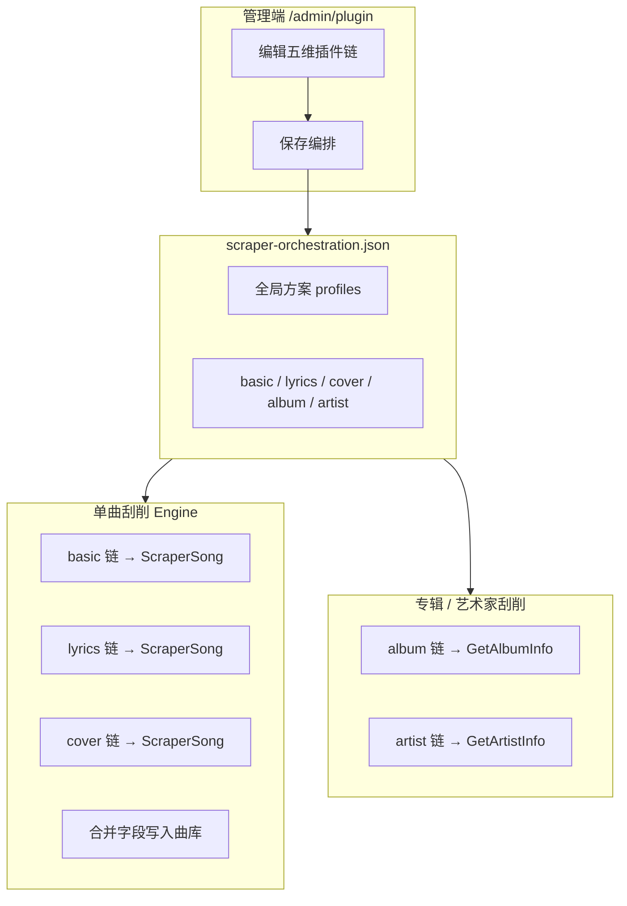

# 插件编排

相关文档：[插件](/plugin) · [第三方插件合集](/plugin-collection) · [插件开发](/plugin-development)

## 1. 什么是插件编排

MusicFree 的刮削类插件各自对接不同外部数据源（网易云、QQ 音乐、MusicBrainz、Spotify 等）。若仅用「全局启用顺序」依次尝试，无法做到：

- **基础信息**用 A 源（匹配更准），**歌词**用 B 源（有翻译），**封面**用 C 源（图质更好）；
- 专辑/艺术家维度的刮削与单曲维度的策略分开配置。

**插件编排**即在持久化配置中为五个**字段维度**分别指定**插件链**（有序列表）。执行时按链顺序尝试，某一插件在该维度返回有效结果即停止该维度的后续尝试；全部失败则按场景回退（见 §4）。

编排与「插件启用/禁用」「插件 JSON 配置」相互独立：插件须先启用，编排链中引用其 **插件 ID**（`manifest` 中的 `name`，如 `mf-plugin-netease`）。



---

## 2. 五个编排维度

| 字段 key | 界面名称   | 宿主调用的插件能力                              | 主要使用场景                                         |
| -------- | ---------- | ----------------------------------------------- | ---------------------------------------------------- |
| `basic`  | 基础信息   | `ScraperSong`                                   | 单曲批量刮削：标题、艺人、专辑、年份、曲目号、流派等 |
| `lyrics` | 歌词       | `GetLyrics` 或 `ScraperSong`（返回歌词字段）    | 单曲刮削：LRC / 纯文本歌词                           |
| `cover`  | 封面       | `GetCover` 或 `ScraperSong`（返回封面 key/URL） | 单曲刮削：专辑封面                                   |
| `album`  | 专辑信息   | `GetAlbumInfo`                                  | 专辑管理页「刮削专辑」：候选列表按链顺序收集         |
| `artist` | 艺术家信息 | `GetArtistInfo`                                 | 艺术家刮削、批量头像匹配等                           |

### 2.1 前端可选插件规则

管理端在添加插件到下拉列表时，会按 manifest 的 `exportedFunctions` 过滤（`supportsOrchestrationField`）：

| 维度     | 至少需声明的能力             |
| -------- | ---------------------------- |
| `basic`  | `ScraperSong`                |
| `lyrics` | `GetLyrics` 或 `ScraperSong` |
| `cover`  | `GetCover` 或 `ScraperSong`  |
| `album`  | `GetAlbumInfo`               |
| `artist` | `GetArtistInfo`              |

**特例**：`mf-plugin-lastfm` 在单曲维度的 `basic` / `lyrics` / `cover` 上被前端显式禁用（API 与专辑/艺术家能力仍可用）。详见 `frontend/src/views/scraperView.helpers.ts` 中的 `FIELD_SUPPORT_OVERRIDES`。

### 2.2 单曲刮削的技术说明

编排模式下，宿主对 `basic` / `lyrics` / `cover` 每条链路均调用插件的 **`ScrapeSong`** 入口（WASM 侧可能内部再调 `GetCover` / `GetLyrics`）。因此：

- 链中的插件必须能成功完成一次 `ScraperSong`（或宿主包装的等价刮削），并在对应维度返回非空有效值；
- 仅导出 `GetAlbumInfo` / `FetchPlaylist`、未导出 `ScraperSong` 的插件**不应**加入单曲的 basic/cover/lyrics 链（适合放在 `album` 或歌单导入场景）。

---

## 3. 配置持久化

### 3.1 配置示例

```json
{
  "schemaVersion": 1,
  "defaultProfileId": "default",
  "userConfigured": true,
  "profiles": [
    {
      "id": "default",
      "name": "网易基础 + QQ 歌词 + MusicBrainz 封面",
      "enabled": true,
      "fields": {
        "basic": ["mf-plugin-netease", "mf-plugin-musicbrainz"],
        "lyrics": ["mf-plugin-qqmusic", "mf-plugin-netease"],
        "cover": ["mf-plugin-musicbrainz", "mf-plugin-spotify"],
        "album": ["mf-plugin-netease", "mf-plugin-musicbrainz"],
        "artist": ["mf-plugin-musicbrainz", "mf-plugin-netease"]
      }
    }
  ]
}
```

## 4. 执行逻辑

### 4.1 何时走编排（`userConfigured`）

| `userConfigured`                      | 行为                                                                       |
| ------------------------------------- | -------------------------------------------------------------------------- |
| `false`（新建默认文件）               | **不走字段编排**；单曲/专辑/艺术家均按注册表中**已启用插件的全局顺序**尝试 |
| `true`（管理员在 UI 保存过）          | 按 `defaultProfileId` 对应方案的各字段链执行                               |
| 字段缺失或 `null`（旧版文件无此字段） | 视为 `true`，兼容历史环境                                                  |

管理员在 **`/admin/plugin`** 点击保存编排后，API 会将 `userConfigured` 设为 `true`。

### 4.2 单曲刮削（批量 / 定向）

当 `userConfigured === true` 且方案 `enabled` 时，引擎对 **`basic`、`lyrics`、`cover`** 分别执行字段链：

1. 按链顺序调用 `plugin.ScrapeSong(query)`；
2. 若返回错误、空结果、或该维度**验收函数**判定无效 → 记录 trace 片段（如 `plugin:error` / `empty`），尝试下一个插件；
3. 若有效 → 合并到本次刮削结果，记录 `fieldSources[field] = 命中插件名`，**停止该维度**；
4. 三个维度至少有一个命中（`hitAny`）→ 写库并标记 `is_scraped`；
5. 若**无一维度命中** → **回退**到传统逻辑：按全局启用顺序遍历插件，选「满足缺失字段最多 / 置信度最高」的单次 `ScrapeSong` 结果。

可选请求参数 **`orchestrationProfileId`**：指定方案 ID；省略则用 `defaultProfileId`。批量任务会把实际使用的方案 ID 写入批次/任务记录。

**各维度「有效」判定（摘要）**

| 维度     | 接受条件（任一满足即有效）                                        |
| -------- | ----------------------------------------------------------------- |
| `basic`  | 非空标题/艺人/专辑，或 `year > 0`，或 `track > 0`，或非空 `genre` |
| `lyrics` | 非空 `lyrics` 或 `lyricsLRC`                                      |
| `cover`  | 非空 `albumCoverKey` 或 `albumCoverURL`                           |

### 4.3 专辑 / 艺术家刮削

- 使用编排中 **`album` / `artist`** 链的顺序；
- **仅使用链上列出的插件**，不会追加其它已启用插件；
- 若某维度链为空或链上插件均不可用 → 返回空候选（不报错）；
- 专辑刮削会为链上每个插件收集候选；艺术家刮削同理（`GetArtistInfo`）。

批量艺术家头像匹配（`ArtistPhotoBatchMatch`）可另传 `pluginOrder` 覆盖顺序，与全局编排独立。

### 4.4 不受编排影响的能力

| 能力                              | 说明                                                                                           |
| --------------------------------- | ---------------------------------------------------------------------------------------------- |
| **RemoteSearch / RemoteDownload** | 音乐搜索 Tab 通过请求体 `pluginNames` 勾选插件，不走 `scraper-orchestration.json`              |
| **FetchPlaylist**                 | 歌单 URL 导入由链接类型与插件能力决定，不用五维编排                                            |
| **插件全局 priority API**         | `PUT /scrapers/:name/priority` 仍影响**未保存编排**（`userConfigured: false`）时的 legacy 顺序 |

## 5. 默认方案与兼容

### 5.1 自动生成

`LoadOrCreate` 在文件不存在时创建：

- `defaultProfileId`: `"default"`
- `userConfigured`: `false`
- 五个字段的链均为**当前所有已启用插件名**，顺序与注册表一致

此状态下行为与升级前的「按启用顺序逐个插件刮削」一致。

### 5.2 保存后

用户在管理端保存编排 → `userConfigured: true` → 单曲三维度与专辑/艺术家维度均严格按 JSON 中的链执行（专辑/艺术家不再追加链外插件）。

### 5.3 回退与排错

| 现象                       | 可能原因                                                                                    |
| -------------------------- | ------------------------------------------------------------------------------------------- |
| 保存编排后刮削「像没生效」 | 链中插件未启用、名称与 manifest `name` 不一致、或该维度全部 `:empty`/`:error` 后走了 legacy |
| 某维度始终没有结果         | 链为空；或插件未导出对应能力；Last.fm 被禁用于 basic/cover/lyrics                           |
| 专辑刮削只有部分源         | 编排 `album` 链只列了部分插件（设计如此，不会自动补全）                                     |

任务结果中的可观测字段（编排命中时）：

| 字段                     | 含义                                                                                  |
| ------------------------ | ------------------------------------------------------------------------------------- |
| `orchestrationProfileId` | 实际使用的方案 ID                                                                     |
| `fieldSources`           | 各维度最终命中的插件，如 `{"basic":"mf-plugin-netease","lyrics":"mf-plugin-qqmusic"}` |
| `fallbackTrace`          | 各维度尝试轨迹，如 `lyrics: ["mf-plugin-qqmusic:empty","mf-plugin-netease:hit"]`      |

`fallbackTrace` 后缀：`:hit` 成功、`:empty` 无有效数据、`:error` 调用失败、`:unsupported` 插件未启用或未注册。

## 6. 管理界面与 API

### 6.1 界面入口


- **插件管理** → `/admin/plugin` → 页内 **编排** 区域
- 五个字段卡片：调整顺序（上移/下移）、添加/移除插件、**保存编排**
- 展开 **JSON 预览** 可查看即将提交的完整配置

音乐刮削 Tab（`/admin/music` → 音乐刮削）发起批量任务时，使用当前默认方案（`defaultProfileId`），无需单独选方案（除非 API 客户端传入 `orchestrationProfileId`）。

## 7. 推荐编排思路

1. **先启用插件并填好凭据**（Spotify、Last.fm 等），再在编排中加入链。
2. **basic**：优先本地化率高的源（网易云 / QQ）或权威库（MusicBrainz）；可设 2～3 个回退。
3. **lyrics**：优先有翻译的 QQ 音乐链，网易云作备选。
4. **cover**：MusicBrainz Cover Art Archive、Spotify 封面常与 basic 源解耦，可单独优化。
5. **album / artist**：与单曲策略分开；Last.fm、MusicBrainz 适合欧美元数据，网易云/QQ 适合中文曲库。
6. 保存后可用**单曲强制刮削** + 任务详情中的 `fieldSources` / `fallbackTrace` 验证是否按预期命中。
