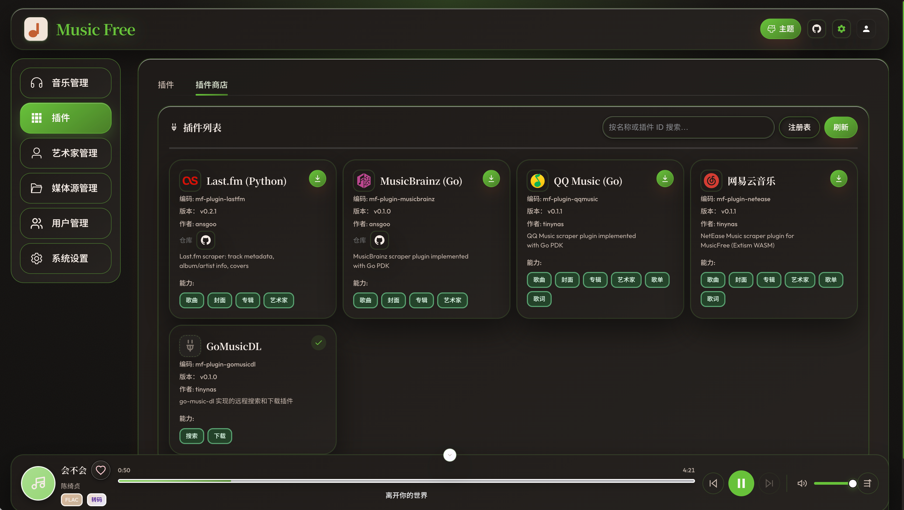

# 插件注册表

插件注册表是一份**远程 JSON 清单**，描述可安装插件的元数据（名称、版本、下载地址等）。在管理后台订阅一个或多个注册表后，[插件商店](/plugin) 会合并展示其中的插件，供安装与更新。

相关文档：[插件](/plugin) · [第三方插件合集](/plugin-collection) · [插件开发](/plugin-development)

## 1. 订阅与使用

1. 打开管理后台 **插件商店**。
2. 在注册表订阅设置中添加注册表 URL（可填多个）。
3. 保存后，宿主会拉取各注册表并合并为商店列表。
4. 安装目标插件、填写配置项并启用；若订阅了多个同类插件，可在 **插件编排** 中调整执行优先级。



### 1.1 常用注册表

| 类型         | 说明                                                                                                        | 地址                                                                                              |
| ------------ | ----------------------------------------------------------------------------------------------------------- | ------------------------------------------------------------------------------------------------- |
| 内置（官方） | 默认已订阅；元数据刮削类插件，[music-free-plugin](https://github.com/ansgoo/music-free-plugin)              | [registry.json](https://cdn.jsdelivr.net/gh/ansgoo/music-free-plugin@main/artifact/registry.json) |
| 社区推荐     | 可选订阅；含远程搜索/下载及国内平台刮削，[musicfree-plugin](https://www.npmjs.com/package/musicfree-plugin) | [registry.json](https://cdn.jsdelivr.net/npm/musicfree-plugin@latest/artifact/registry.json)      |

各注册表当前收录的插件、能力矩阵与配置项见 [第三方插件合集](/plugin-collection)。

> **说明**：官方注册表不收录可能存在侵权风险的插件；社区注册表由第三方维护，使用前请自行评估合规性。

### 1.2 合并与冲突规则

订阅多个注册表时，宿主按**订阅顺序**依次合并条目：

| 情况                                            | 行为                                                             |
| ----------------------------------------------- | ---------------------------------------------------------------- |
| 多个注册表出现相同 `name` **且** 相同 `version` | **后订阅**的注册表条目覆盖先订阅的（仅影响商店列表展示）         |
| 相同 `name` 的插件                              | 服务端**只能安装一份**；已安装的同名插件不会因另一注册表重复出现 |

`features` 字段仅用于商店展示；插件实际能力以 ZIP 内 `manifest.json` 的 `exportedFunctions` 为准（见 [插件开发](/plugin-development)）。

## 2. 注册表数据协议

注册表文件为 **JSON 数组**，每个元素描述一个插件条目。

### 2.1 示例

```json
[
  {
    "name": "mf-plugin-lastfm",
    "title": "Last.fm (Python)",
    "version": "0.2.1",
    "description": "Last.fm scraper: track metadata, album/artist info, covers",
    "author": "ansgoo",
    "license": "MIT",
    "repository": "https://github.com/ansgoo/music-free-plugin/mf-plugin-lastfm",
    "features": ["ScraperSong", "GetCover", "GetAlbumInfo", "GetArtistInfo"],
    "download_url": "https://cdn.jsdelivr.net/gh/ansgoo/music-free-plugin@main/artifact/mf-plugin-lastfm.zip",
    "icon": "https://cdn.jsdelivr.net/gh/ansgoo/music-free-plugin@main/plugin/mf-plugin-lastfm/icon.svg"
  }
]
```

### 2.2 字段说明

| 字段               | 必填 | 说明                                                                                   |
| ------------------ | :--: | -------------------------------------------------------------------------------------- |
| `name`             |  是  | 插件唯一 ID，须满足 `^[a-z][a-z0-9_-]{1,63}$`，且与 ZIP 内目录名、`manifest.name` 一致 |
| `title`            |  是  | 商店展示名                                                                             |
| `version`          |  是  | 版本字符串，非空且 ≤ 64 字符                                                           |
| `download_url`     |  是  | 插件 ZIP 的 **http(s)** 直链                                                           |
| `description`      |  否  | 简短说明                                                                               |
| `author`           |  否  | 作者                                                                                   |
| `license`          |  否  | 许可证                                                                                 |
| `repository`       |  否  | 源码仓库 URL                                                                           |
| `features`         |  否  | 能力标签（展示用），如 `ScraperSong`、`RemoteSearch`                                   |
| `icon`             |  否  | HTTPS 图片 URL 或 base64，用于商店图标                                                 |
| `id`               |  否  | **已废弃**：旧版唯一键；解析时会迁移为 `name`                                          |
| `sourceRegistryId` |  否  | 合并后由服务端写入，标识条目来源订阅，发布时无需填写                                   |

### 2.3 与插件包的关系

- `download_url` 指向的 ZIP 须符合 [插件开发](/plugin-development) 中的打包约定（目录名 = `manifest.name`，含 `manifest.json` 与 `plugin.wasm` 等）。
- 注册表中的 `version` 应与 ZIP 内 `manifest.json` 的 `version` 一致，便于用户识别更新。
- `features` 建议与 manifest 中实际导出的宿主能力名保持一致，便于在商店中预览能力。

## 3. 发布与自建注册表

若你开发了插件并希望分享给他人，可以：

1. 将插件 ZIP 发布到可公网访问的托管（如 GitHub Releases、jsDelivr、npm 静态资源等）。
2. 在 `registry.json` 中新增对应条目（或向既有公共注册表提交 PR）。
3. 将 `registry.json` 托管在稳定 URL 上，把该 URL 提供给其他用户订阅；也可在自有 MusicFree 实例中单独订阅。

发布流程与打包细节见 [插件开发](/plugin-development) 第 9 节「发布」。参考实现仓库：[music-free-plugin](https://github.com/ansgoo/music-free-plugin)。
