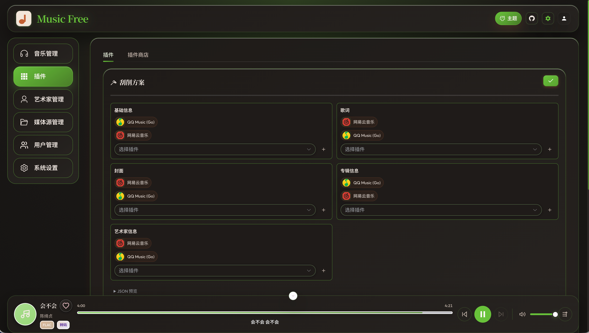

# MusicFree 插件

**插件是MusicFree的核心功能，插件让MusicFree有了无限的可能**

- MusicFree的音乐`在线搜索`和`在线下载`功能依赖第三方插件实现 `RemoteSeach`和`RemoteDownload`接口

- MusicFee的音乐作品的`基本信息刮削`、`封面刮削`、`歌词刮削`功能依赖第三方插件实现`ScraperSong`、 `GetCover`和`GetLyrics`的接口

- MusicFee的音乐作品的基艺术家信息匹配功能依赖第三方插件实现`GetArtistInfo`的接口实现

- MusicFree的歌单同步依赖于第三方插件实现`FetchPlaylist`的接口

后期MusicFree和第三方平台的交互基本也是基于插件实现

## 插件商店

插件商店中收录了各种各样的插件让用户选择，MusicFree允许用户订阅第三方插件注册表，实现插件商店扩充

## 插件编排

当用户订阅相同功能的多个插件时，MusicFree允许对多个相同功能的插件插件进行编排，从而确定功能在执行过程中的优先级

