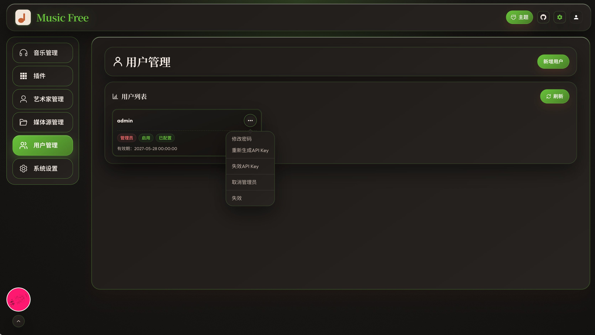
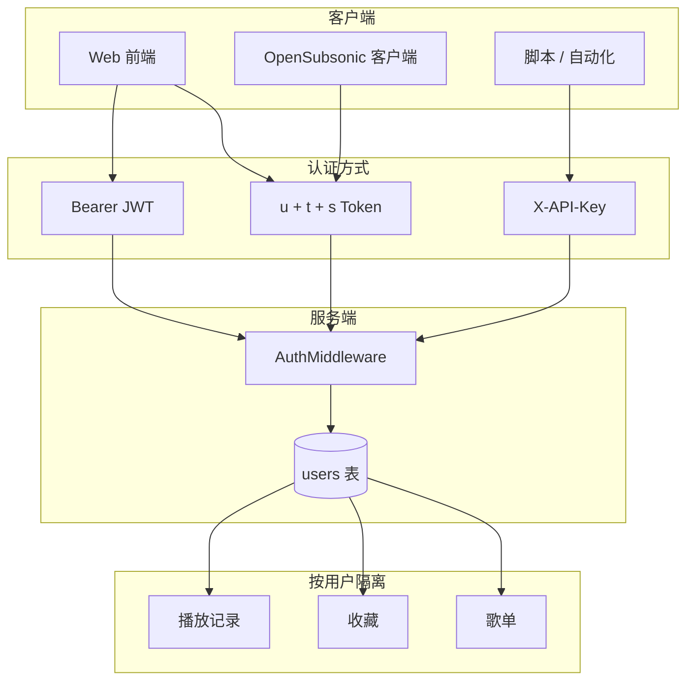

# 用户

相关文档：[歌单](/playlist) · [OpenSubsonic API](/opensubsonic-api) · [Navidrome API](/navidrome-api)



## 1. 模块概述

**用户模块**负责 MusicFree 的账号体系：登录 Web 界面、多方式 API 认证、管理员对用户与 API Key 的生命周期管理，以及按用户隔离的私有数据（歌单、收藏、播放记录等）。

功能分布在两个层面：

| 层面           | 入口                               | 主要用户 |
| -------------- | ---------------------------------- | -------- |
| **登录与会话** | `/login`                           | 所有用户 |
| **用户管理**   | `/admin/users`（侧栏「用户管理」） | 管理员   |



## 2. 访问与角色

### 2.1 角色类型

| 角色         | `isAdmin` | 能力概要                                                                 |
| ------------ | --------- | ------------------------------------------------------------------------ |
| **管理员**   | `true`    | 访问 `/admin/*` 管理后台（音乐管理、插件、媒体源、用户管理、系统设置等） |
| **普通用户** | `false`   | 浏览曲库、播放、自建/导入歌单、收藏等；**不能**进入管理后台              |

### 2.2 账号状态

| 状态     | `isActive` | 行为                                               |
| -------- | ---------- | -------------------------------------------------- |
| **启用** | `true`     | 可登录、可通过任意已配置认证方式访问 API           |
| **失效** | `false`    | 无法登录；所有认证方式均拒绝（对外表现为认证失败） |

管理员**不能**将**自己**设为失效，也不能**取消自己的管理员身份**（防止锁死系统）。

## 3. 登录（/login）

### 3.1 Web 登录流程

1. 用户输入 **用户名**、**密码**。
2. 前端调用 `POST /rest/api/v1/auth/login`（Navidrome 兼容路径亦提供 `POST /auth/login`）。
3. 服务端校验 `md5(password + salt)` 与数据库中的 `password` 字段，并检查 `isActive`。
4. 成功后返回：
   - `subsonicSalt`：用户固定盐（库内 `users.salt`）
   - `token`：JWT（约 24 小时有效，供 Bearer 认证）
   - `isAdmin`：是否管理员
5. 前端将 `userSalt = md5(password + subsonicSalt)` 存入 Pinia / `localStorage`（**不持久化明文密码**），后续所有 `/rest` 请求自动附带 OpenSubsonic 参数 `u`、`t`、`s`。

登录失败时显示「用户名或密码错误」或「账号已失效」。

### 3.2 登出

清除本地 `username`、`userSalt`、`isAdmin` 等会话信息；再次访问受保护页面会跳转登录页。认证失败（错误码 40 等）时前端也会触发会话过期处理。

### 3.3 默认管理员

数据库**首次初始化**且无任何用户时，系统自动创建默认管理员：

- 用户名、密码来自 `config.yaml` → `auth.default_user` / `auth.default_password`（常见为 `admin` / `admin`）。
- **首次部署后请尽快修改默认密码**，并在生产环境修改配置中的默认值。

## 4. 认证方式（API）

受保护接口经 `AuthMiddleware` 校验，按以下**优先级**尝试（命中即通过）：

| 优先级 | 方式                                                      | 典型场景                               |
| ------ | --------------------------------------------------------- | -------------------------------------- |
| 1      | **`X-API-Key` 请求头**                                    | 自动化脚本、第三方集成                 |
| 2      | **`Authorization: Bearer <JWT>`** 或 `X-ND-Authorization` | Navidrome 风格客户端、登录后拿到的 JWT |
| 3      | **OpenSubsonic Token：`u` + `t` + `s`**                   | Web 前端、Feishin 等 Subsonic 客户端   |
| —      | **`u` + `p` 明文密码**                                    | **不支持**（返回不支持该认证方式）     |

### 4.1 OpenSubsonic Token（u / t / s）

查询参数（或 POST form）：

- `u`：用户名
- `t`：token = `md5(password + s)` 的兼容变体（服务端同时支持多种派生方式，见下）
- `s`：客户端随机盐（每次请求应不同，长度 ≥ 6）

服务端校验顺序包括：

- `md5(subsonic_password + salt)`（明文口令字段，与官方公式一致）
- `md5(subsonic_password_md5 + salt)`（常见客户端变体）
- 遗留：`md5(stored_password_hash + salt)`

Web 前端在 Axios 拦截器中每次请求生成随机 `s`，并用本地保存的 `userSalt`（即 `md5(登录密码 + 用户固定盐)`）计算 `t`。

### 4.2 API Key（管理员签发）

管理员在 **用户管理** 中为某用户 **生成 API Key**：

- 服务端生成随机密钥，**仅展示一次**；库内仅存 **SHA-256 哈希**。
- 可选设置 **失效时间** `apiKeyExpiresAt`；到期后认证失败。
- 可 **立即失效**（`revoke`），或随 **修改密码** 自动清空。

客户端请求时设置：

```http
X-API-Key: <生成时复制的密钥>
```

无需再传 `u`/`t`/`s`。适用于 CI、监控脚本等**非交互**场景。

### 4.3 JWT（登录接口返回）

`POST .../auth/login` 响应中的 `token` 字段为 JWT，默认有效期约 **24 小时**。Navidrome 兼容客户端可使用：

```http
Authorization: Bearer <token>
```

## 5. 用户管理（/admin/users）

仅 **管理员** 可访问。以卡片列表展示全部用户，支持刷新与移动端「更多操作」菜单。

### 5.1 用户卡片信息

- 用户名
- 标签：**管理员 / 普通用户**、**启用 / 失效**、**API Key 已配置 / 未配置**
- API Key **有效期**（未设置则显示 `-`）

### 5.2 新增用户

- 填写 **用户名**、**初始密码**、**确认密码**（前端校验一致性与用户名格式）。
- 新建用户默认为 **普通用户**、**启用** 状态。
- 用户名不可与已有账号重复。

### 5.3 修改密码（管理员代改）

- 须输入该用户 **当前密码**（非管理员自己的密码）以验证身份。
- 设置 **新密码** 并确认。
- 保存后：
  - 更新登录哈希与 OpenSubsonic 口令字段；
  - **自动清空并失效** 该用户已有 **API Key**（须重新生成）。

> 当前 Web 端**没有**普通用户自助改密页面；非管理员需联系管理员在用户管理中修改。

### 5.4 API Key 管理

| 操作                | 说明                                                                |
| ------------------- | ------------------------------------------------------------------- |
| **生成 / 重新生成** | 弹出对话框，可选失效时间；保存后明文 Key **只显示一次**，需立即复制 |
| **失效 API Key**    | 立即作废，后续 `X-API-Key` 请求失败                                 |

### 5.5 角色与状态

| 操作                        | 限制                         |
| --------------------------- | ---------------------------- |
| **设为管理员 / 取消管理员** | 不能取消**自己**的管理员身份 |
| **启用 / 失效**             | 不能将**自己**设为失效       |

## 6. 用户与业务数据隔离

登录成功后，请求上下文携带 `userId`，以下数据按用户区分：

| 数据         | 隔离方式                                               |
| ------------ | ------------------------------------------------------ |
| **歌单**     | `playlists.user_id`；可见本人歌单 + 他人 **公开** 歌单 |
| **收藏**     | `user_favorite_songs`；`/myfavorites` 仅当前用户       |
| **播放记录** | `play_history` 关联用户；统计 API `/stats/user` 等     |
| **管理操作** | 扫描、刮削、插件配置等仅管理员                         |

曲库中的 **歌曲 / 专辑 / 艺术家** 为**全局共享**媒体库；用户差异主要体现在歌单、收藏与播放行为，而非各自独立的文件目录（除非未来扩展 per-user 库）。

## 7. OpenSubsonic 用户接口

| 接口      | 说明                                                                           |
| --------- | ------------------------------------------------------------------------------ |
| `getUser` | 查询指定用户名的 OpenSubsonic 用户信息（角色位：`adminRole`、`streamRole` 等） |
| 权限      | 仅可查询 **本人**；管理员可查询 **任意启用用户**                               |
| 失效用户  | 对非管理员表现为「用户不存在」                                                 |

`ping` 等接口用于客户端连通性检测，不绑定具体用户数据。

## 8. 典型工作流

### 8.1 首次部署

```text
启动服务 → 使用 config 中默认 admin 登录
    → /admin/users 修改 admin 密码
    → 创建普通用户账号 → 分发用户名与初始密码
```

### 8.2 为自动化任务签发 API Key

```text
/admin/users → 选择用户 → 生成 API Key → 复制保存
    → 脚本请求头设置 X-API-Key
    → 可选设置过期时间；离职时「失效 API Key」
```

### 8.3 客户端（Feishin 等）连接

```text
服务器地址填 MusicFree 的 `/rest` 根路径
    → 用户名 + 密码（OpenSubsonic 方式）
    → 或使用 u/t/s Token 模式（与 Subsonic 一致）
```

### 8.4 停用账号

```text
/admin/users → 对用户执行「失效」
    → 该用户无法登录，API Key 与 Token 均不可用
```

## 9. 安全建议

- 部署后立即修改 **默认 admin 密码**，并限制管理后台仅内网或 VPN 可达（若可能）。
- **API Key** 视同密码保管；泄露后应立即 **失效** 并重新生成。
- 修改用户密码会使旧 API Key 失效，属预期行为。

## 10. 常见问题

**Q：忘记密码怎么办？**  
A：管理员在 `/admin/users` 使用该用户 **当前密码** 验证后设置新密码。

**Q：普通用户能访问 /admin 吗？**  
A：不能。路由与 API 均有管理员校验。

**Q：API Key 和登录密码有什么区别？**  
A：登录密码用于 Web 登录与 OpenSubsonic `u/t/s`；API Key 仅用于 `X-API-Key` 头，由管理员单独签发，可设过期与吊销。

**Q：失效用户的数据会删除吗？**  
A：不会自动删除歌单、收藏等；仅禁止登录与 API 访问。如需清理需另行处理数据。

**Q：一个服务器可以多用户同时使用吗？**  
A：可以。每用户独立歌单与收藏；媒体库共享。公开歌单可被其他用户浏览。
