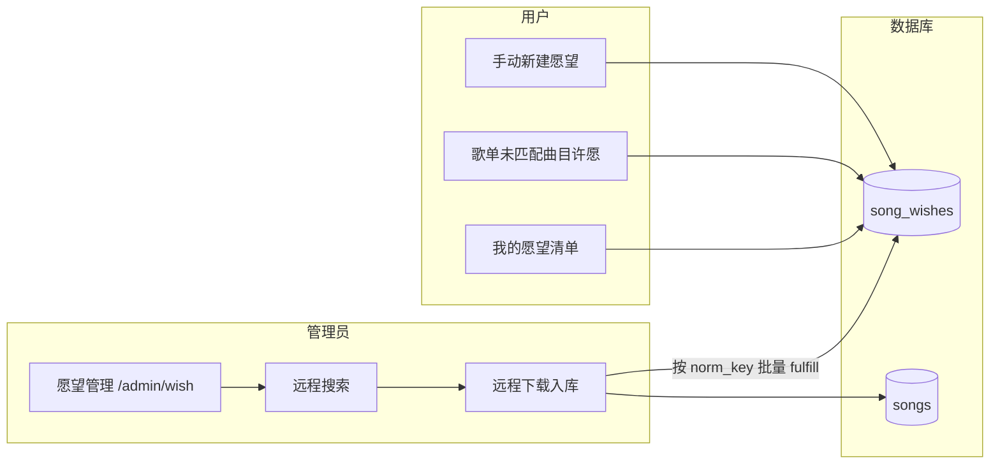

# 许愿

相关文档：[歌单](/playlist) · [音乐管理](/music) · [插件合集](/plugin-collection) · [用户](/user)

## 1. 模块概述

**歌曲许愿**连接「用户缺歌需求」与「管理员入库运维」：用户为**尚未入库**的曲目提交元数据（作品名、艺术家、专辑），管理员在后台检索、下载或标记实现后，愿望状态闭环。

典型场景：从网易云等平台 **[导入歌单](/playlist)** 后，部分曲目在本地曲库**未匹配**（`playable: false`）。用户可在歌单详情 **逐首许愿** 或 **许愿全部未匹配**，管理员在 **愿望管理** 页统一处理。



**能力边界**：

- 愿望仅通过 **内部 REST + Web UI** 暴露，**不在 OpenSubsonic** 协议中提供。
- 系统**不会**根据愿望自动后台下载；须管理员手动选源下载，或曲目已由其他途径入库时使用 **标记已实现**。

## 2. 访问与权限

| 角色     | 入口                                         | 路径             |
| -------- | -------------------------------------------- | ---------------- |
| 普通用户 | 头像菜单 → **我的愿望**                      | `/wishes`        |
| 普通用户 | 外部歌单详情 → **许愿** / **许愿全部未匹配** | `/playlists/:id` |
| 管理员   | 管理后台侧栏 → **愿望管理**                  | `/admin/wish`    |

- **用户端**：须登录；只能查看与管理**本人**愿望。
- **管理端**：须管理员权限（`requiresAdmin`）；非管理员访问页面或 API 会被拒绝。

## 3. 愿望状态与去重

### 3.1 状态机

| 状态   | 值          | 说明                                    |
| ------ | ----------- | --------------------------------------- |
| 待处理 | `pending`   | 等待管理员处理                          |
| 已实现 | `fulfilled` | 管理员标记实现，或下载成功后批量更新    |
| 已拒绝 | `rejected`  | 管理员填写拒绝原因；用户可 **重新许愿** |

### 3.2 归一化键（`norm_key`）

系统对 **作品名 + 艺术家 + 专辑** 做归一化（去首尾空白、合并连续空白、统一全角空格等），拼接为 `title|artist|album` 作为 `norm_key`：

- **去重**：同一用户对相同 `norm_key` 在存在 **`pending`** 愿望时，不能再次创建。
- **批量实现**：管理员将某条愿望实现时，所有用户、所有 **`pending`** 且 **相同 `norm_key`** 的记录一并变为 `fulfilled`。
- **已实现后可再许愿**：某用户该键上一条为 `fulfilled` 时，允许再次创建新的 `pending`（例如补录不同版本）。

来自歌单的许愿还会按 **`playlist_song_id`** 检查：若该条目已有 `pending` 愿望，视为重复。

### 3.3 歌单详情上的 `wishStatus`

`GET /rest/api/v1/playlists/:id` 每条曲目对**当前登录用户**附带 `wishStatus`：

| 值          | 含义                                                               |
| ----------- | ------------------------------------------------------------------ |
| `none`      | 未许愿，或愿望已实现但条目**仍不可播**（本地仍未匹配，可继续许愿） |
| `wished`    | 存在 `pending` 愿望                                                |
| `fulfilled` | 存在 `fulfilled` 愿望且条目**已可播**                              |

## 4. 用户端操作

### 4.1 我的愿望（`/wishes`）

- **入口**：登录后点击右上角头像 → **我的愿望**。
- **筛选**：待处理（`pending`）、已实现（`fulfilled`）、已拒绝（`rejected`）。
- **新建愿望**：填写作品名、艺术家（必填）、专辑（可选）；提交后进入待处理列表。
- **已拒绝**：展示 `rejectReason`；点击 **重新许愿** 基于原信息创建新的 `pending` 记录。

### 4.2 外部歌单详情

仅当歌单存在 **`externalSource`**（平台导入歌单）且曲目 **`playable: false`** 时显示许愿相关 UI：

| 操作               | 说明                                                                                       |
| ------------------ | ------------------------------------------------------------------------------------------ |
| 行内 **许愿**      | 为单首未匹配曲目创建愿望；成功后显示 **已许愿**，不可重复点击                              |
| **许愿全部未匹配** | 对该歌单所有未匹配且当前用户尚未 `pending` 的条目批量创建；提示 `created` / `skipped` 数量 |
| 点击许愿           | **不会**触发播放（与不可播条目行为一致）                                                   |

许愿成功后前端会**刷新歌单详情**以更新 `wishStatus`。

> **自建歌单**不支持行内许愿；若曲库缺少该曲，请在 **我的愿望** 手动填写元数据，或从曲库 **添加歌曲**。

## 5. 管理员操作（`/admin/wish`）

### 5.1 愿望列表

- **默认**：仅展示 **`pending`**；可切换已实现、已拒绝或全部。
- **列信息**：作品名、艺术家、专辑、提交用户、状态、来源等。

### 5.2 实现愿望（推荐：搜索 + 下载）

对待处理愿望：

1. 点击 **搜索**：侧栏以「作品名 + 艺术家 + 专辑」为关键词，流式调用 **`POST /rest/api/v1/remote-search`**（NDJSON），展示各插件候选（与 [音乐管理 · 音乐搜索](/music) 相同）。
2. 在结果中选择条目，**下载并实现**：调用 **`POST /rest/api/v1/admin/wishes/:id/fulfill-download`**，内部先执行 `remoteDownload` 入库，再按该愿望的 `norm_key` **批量** `fulfill`。
3. 成功提示 **愿望已实现**，并显示 `fulfilledCount`（同键待处理条数）。

下载失败时愿望保持 `pending`，可换源重试。

### 5.3 其他管理操作

| 操作           | 说明                                                                                            |
| -------------- | ----------------------------------------------------------------------------------------------- |
| **拒绝**       | 必填拒绝原因；状态变为 `rejected`                                                               |
| **标记已实现** | 不经过下载，直接将同 `norm_key` 下所有 `pending` 标为 `fulfilled`（适用于曲目已由其他途径入库） |

### 5.4 实现后的歌单关联

下载或标记实现成功后，服务端会尝试将**相同 `norm_key`** 且仍 **未匹配** 的歌单占位条目，按标题 + 艺术家（或外部元数据）**关联**到新入库的 `song_id`。

若本地仍无法匹配，用户侧 `wishStatus` 可能仍为 `none`，可引导用户再次 **[同步歌单](/playlist)**。

## 6. 典型工作流

### 6.1 用户侧

```text
导入网易云歌单 → 打开详情看到未匹配曲目
    → 单首「许愿」或「许愿全部未匹配」
    → 「我的愿望」查看待处理
    → 管理员入库后状态变为已实现
    → 同步歌单 → 条目可播放
```

若被拒绝：查看原因 → **重新许愿**。

### 6.2 管理员侧

```text
/admin/wish 查看待处理愿望
    → 搜索 → 选择候选 → 下载并实现
    → 同 norm_key 的多用户愿望一并 fulfilled
    → 通知用户同步歌单（若仍不可播）
```

无远程插件时：先将曲目以其他方式入库（如 [音乐管理 · 音乐搜索](/music)），再对愿望使用 **标记已实现**。

## 7. 常见问题

**Q：为什么已实现的愿望在歌单里仍显示「许愿」？**  
A：实现只表示管理员已处理；若下载后歌单条目仍 `playable: false`（未匹配到本地文件），界面将 `wishStatus` 置为 `none`，允许再次许愿。请 **同步歌单** 或检查标签是否与本地一致。

**Q：两名用户许愿同一首歌，管理员只下载一次够吗？**  
A：够。实现时按 **`norm_key`** 批量将所有用户的 `pending` 标为 `fulfilled`。

**Q：管理员没有远程插件怎么办？**  
A：在 `/admin/plugin` 安装并启用带 `remoteSearch` / `remoteDownload` 的插件；或先将曲目以其他方式入库，再对愿望使用 **标记已实现**。

**Q：拒绝后还能再提交吗？**  
A：可以。在 **我的愿望** 中对已拒绝记录点击 **重新许愿**，或手动新建（若无同键 `pending`）。

**Q：自建歌单里的歌能许愿吗？**  
A：许愿 UI 仅针对 **平台导入** 且 **未匹配** 的条目。自建歌单请用 **添加歌曲** 从已有曲库选取；若曲库没有该曲，可在 **我的愿望** 手动填写元数据。
